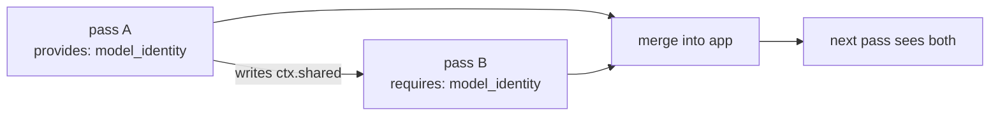

import { Aside, Steps, LinkCard, CardGrid, Tabs, TabItem } from "@astrojs/starlight/components";

After the symbol table and base call graph are built, codeanalyzer runs a pipeline of **analysis passes**. A pass is a whole-application step that can contribute two things:

- **Entrypoints** — framework-dispatched roots (a new framework's routes, tasks, commands).
- **Synthetic call edges** — dispatch the static call graph can't observe (e.g. an Odoo ORM `write()` that triggers an `@api.depends` compute method).

Passes ship in-tree, and out-of-tree packages register their own through the `codeanalyzer.analysis_passes` entry-point group — so you can teach codeanalyzer a new framework or a new dispatch mechanism **without forking it**.

<Aside type="note" title="Pass output is never cached">
Core caches only the symbol table and base call graph. The pipeline re-runs on every `analyze()`, so your pass's entrypoints and edges can never go stale when you add, change, or remove it.
</Aside>

## The AnalysisPass contract

A pass subclasses `AnalysisPass`, sets a `name`, and implements `run`. It receives the current `PyApplication` (already enriched by upstream passes) and a shared `AnalysisContext`, and returns an `AnalysisResult`.

```python
from codeanalyzer.analysis import AnalysisPass, AnalysisContext, AnalysisResult
from codeanalyzer.schema.py_schema import PyApplication

class MyPass(AnalysisPass):
    name = "my-pass"
    provides = frozenset()      # capability tokens this pass makes available
    requires = frozenset()      # capability tokens it needs satisfied first

    def run(self, app: PyApplication, ctx: AnalysisContext) -> AnalysisResult:
        result = AnalysisResult()
        # ... inspect app.symbol_table, append to result ...
        return result
```

<Aside type="caution" title="Treat `app` as read-only">
Don't mutate `app`. Return your contributions in the `AnalysisResult`; the registry merges them in — appending entrypoints to `app.entrypoints[framework]` and folding synthetic edges into `app.call_graph` via `merge_edges` — *before* the next pass runs, so passes compose.
</Aside>

## Ordering with requires / provides

Passes declare capability tokens — free-form strings — in `provides` and `requires`. The registry topologically sorts on them: a pass that `requires={"odoo.model_identity"}` runs after whichever pass `provides={"odoo.model_identity"}`. Ties break by `name` for determinism. An unsatisfied requirement or a dependency cycle is a hard error (`PassOrderingError`).

Passes hand derived facts to each other through `ctx.shared`, keyed by capability token: the provider writes `ctx.shared["odoo.model_identity"] = ...`; the consumer reads it back. `ctx.shared` is the one mutable part of the otherwise-frozen context.



## The AnalysisContext

Built once after the base graph is ready, then immutable (except `shared`):

| Field | Description |
| --- | --- |
| `external_bindings` | Output of a routing pre-pass, keyed by target `PyCallable.signature`. Empty for non-web / non-CLI projects. |
| `resolve_base_chain(fqcn)` | Returns the transitive base-class chain for a class FQCN — used by inheritance-based finders. |
| `shared` | Mutable inter-pass scratch space, keyed by capability token. Never serialized. |

## Writing an entrypoint finder

Entrypoint finding is a *kind* of pass. Subclass `AbstractEntrypointFinder` (a thin `AnalysisPass`), set `framework_name`, and implement two predicates — `run` is provided and iterates the symbol table for you.

<Tabs>
  <TabItem label="Finder">
```python
from typing import List, Optional
from codeanalyzer.frameworks._base import (
    AbstractEntrypointFinder, AnalysisContext,
)
from codeanalyzer.schema.py_schema import PyCallable, PyClass, PyEntrypoint

class MyFrameworkFinder(AbstractEntrypointFinder):
    framework_name = "myframework"

    def find_function(self, func: PyCallable, ctx: AnalysisContext) -> Optional[PyEntrypoint]:
        # Decorator-, convention-, or binding-bound roots.
        for dec in func.decorators:
            if dec.qualified_name == "myframework.route":
                return PyEntrypoint(
                    signature=func.signature,
                    framework=self.framework_name,
                    detection_source="decorator",
                    route_path=dec.positional_arguments[0] if dec.positional_arguments else None,
                )
        return None

    def find_class(self, cls: PyClass, ctx: AnalysisContext) -> List[PyEntrypoint]:
        # Inheritance-based dispatch: one entrypoint per dispatched method.
        # Return [] for frameworks where class-level detection doesn't apply.
        return []
```
  </TabItem>
  <TabItem label="Predicates">
```text
find_function  → decorator / convention / binding-bound roots
                 (Flask @app.route, FastAPI @router.get,
                  Celery @shared_task, Click @cli.command,
                  the Lambda def handler(event, context) shape)

find_class     → inheritance-based dispatch, one PyEntrypoint
                 per framework-dispatched method
                 (Tornado RequestHandler.get/post, Django CBV,
                  gRPC Servicer RPC methods)
```
  </TabItem>
</Tabs>

Use `ctx.resolve_base_chain(cls.signature)` inside `find_class` to recognize subclasses several levels below a framework base class.

## Writing a synthetic-edge pass

When a framework dispatches a call the static graph can't see, emit a `PyCallEdge` with your own `provenance` token and carry the reasoning an LLM needs in `tags`:

```python
from codeanalyzer.analysis import AnalysisPass, AnalysisContext, AnalysisResult
from codeanalyzer.schema.py_schema import PyApplication, PyCallEdge

class OdooDispatchPass(AnalysisPass):
    name = "odoo-orm-dispatch"

    def run(self, app: PyApplication, ctx: AnalysisContext) -> AnalysisResult:
        result = AnalysisResult()
        result.call_edges.append(PyCallEdge(
            source="odoo.addons.sale.models.SaleOrder.write",
            target="odoo.addons.sale.models.SaleOrder._compute_amount",
            provenance=["odoo_orm_dispatch"],
            tags={
                "odoo.trigger.op": "write",
                "odoo.trigger.fields": "partner_id,pricelist_id",
                "odoo.trigger.model": "sale.order",
            },
        ))
        return result
```

Core never interprets your `provenance` tokens, `detection_source` values, or `tags` keys — they round-trip through `analysis.json` untouched, so downstream consumers (or an LLM) can reason over them.

## Registering your pass

Declare the entry point in your package's `pyproject.toml`. Each entry point must resolve to an `AnalysisPass` subclass (or an instance).

```toml title="pyproject.toml"
[project.entry-points."codeanalyzer.analysis_passes"]
myframework = "my_package.finders:MyFrameworkFinder"
odoo-dispatch = "my_package.passes:OdooDispatchPass"
```

<Steps>

1. **Install your package** into the same environment as codeanalyzer (`pip install -e .`).

2. **Run codeanalyzer normally.** `discover_passes()` finds your entry point, instantiates it, and the registry orders it among the built-ins.

3. **Check the artifact.** Your entrypoints appear under `app.entrypoints[framework]`; your edges appear in `app.call_graph` with your provenance token.

</Steps>

<Aside type="note" title="Failures are isolated">
A pass that raises while loading or running is logged and skipped — extension code is treated as untrusted and never aborts the whole analysis. A non-conforming entry point (not an `AnalysisPass`) is skipped with a warning.
</Aside>

## Where to go next

<CardGrid>
  <LinkCard title="Entrypoint detection" description="The frameworks and detection sources the built-in finders cover." href="/codeanalyzer-python/guides/entrypoints/" />
  <LinkCard title="Output schema" description="The PyEntrypoint and PyCallEdge models your pass produces." href="/codeanalyzer-python/reference/schema/" />
  <LinkCard title="Core concepts" description="Where the pass pipeline sits in the overall flow." href="/codeanalyzer-python/guides/concepts/" />
</CardGrid>
