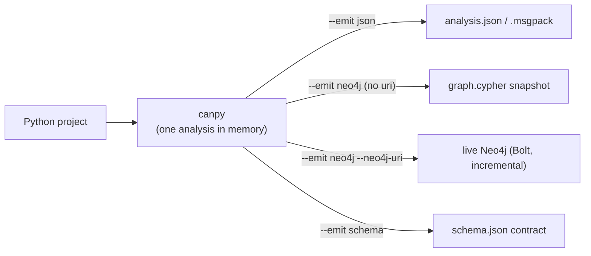

import { Aside, LinkCard, CardGrid, Tabs, TabItem } from "@astrojs/starlight/components";

The `canpy` command runs static analysis on a Python project and builds one `PyApplication` artifact in memory, then emits it to your chosen target. This guide walks through the common invocations; for the full flag table see the [CLI reference](/codeanalyzer-python/reference/cli/).

<Aside type="note" title="The command is now `canpy`">
The CLI was renamed from `codeanalyzer` to `canpy` (matching the `cants` TypeScript sibling). The old `codeanalyzer` command still works as a deprecated alias — it prints a notice to stderr and delegates to `canpy` — but you should migrate your scripts.
</Aside>

## Basic analysis

The only required flag is `--input` (`-i`), the project root:

```bash
canpy --input ./my-python-project
```

With no `--output`, the analysis is printed to stdout as compact JSON. Add `--output` (`-o`) to write it to a file instead:

```bash
canpy --input ./my-python-project --output ./out
# -> ./out/analysis.json
```

<Aside type="note">
`--output` takes a **directory**. The file is named `analysis.json` (or `analysis.msgpack`) inside it; the directory is created if it doesn't exist.
</Aside>

## Emit targets

`canpy` builds a single analysis in memory and can emit it three ways via `--emit`:

| `--emit` | Output | Needs `--input`? | Extra deps |
| --- | --- | --- | --- |
| `json` (default) | `analysis.json` (or `analysis.msgpack`) | yes | — |
| `neo4j` | a `graph.cypher` snapshot, or a live Bolt push with `--neo4j-uri` | yes | only the Bolt push: `[neo4j]` |
| `schema` | the version-stamped Neo4j `schema.json` contract | no | — |

`json` is the default and is what the rest of these examples build on. `neo4j` projects the same in-memory `PyApplication` into a labeled property graph (covered below). `schema` serializes the static, project-independent schema contract — no analysis runs, so `--input` is optional:

```bash
# Print the schema contract to stdout...
canpy --emit schema

# ...or write it to a directory as schema.json
canpy --emit schema --output ./out
# -> ./out/schema.json
```



## The Neo4j property graph

`--emit neo4j` projects the analysis into a labeled property graph instead of a single JSON blob. Every node label is `Py`-prefixed and every relationship type is `PY_`-prefixed (`:PyClass`, `:PyCallable`, `PY_CALLS`, `PY_DECLARES`), so the Java, TypeScript, and Python analyzers can share one database without label or relationship-type collisions. Declarations are keyed by their `signature` under a shared `:PySymbol` label. For the full topology see the [graph schema reference](/codeanalyzer-python/reference/schema/).

The graph is anchored at a single `:PyApplication` node, and there are two ways to populate it — a self-contained snapshot or a live incremental push — chosen solely by whether `--neo4j-uri` is set.

### The application anchor: `--app-name`

`--app-name` sets the name of the single `:PyApplication` root node for this graph. It is the merge key (uniqueness-constrained), and everything else hangs off it via `PY_HAS_MODULE`. When omitted it defaults to the basename of the resolved `--input` directory:

```bash
canpy --input ./my-service --emit neo4j --app-name my-service
# the :PyApplication anchor is named "my-service"
```

The anchor name also **scopes** every graph mutation, so many applications can live in one database without clobbering each other:

- The `graph.cypher` snapshot wipes only `(:PyApplication {name: <app>})` and its module subtree before reloading.
- The Bolt orphan prune on a full run is scoped to `(:PyApplication {name: $app})-[:PY_HAS_MODULE]->(:PyModule)`, so pushing app B never deletes app A's modules from a shared cluster.

Each graph also carries a `schema_version` (currently `1.1.0`) stamped on its `:PyApplication` node, and it is the value the [CLDK Python SDK](#reading-the-graph-from-the-cldk-sdk) matches via `application_name` to read back exactly this app's subgraph. Keep `--app-name` (CLI) and `application_name` (SDK) identical.

### Snapshot vs. live push

<Tabs>
<TabItem label="Snapshot (graph.cypher)">

Without `--neo4j-uri`, `canpy` writes a self-contained `graph.cypher` file: the constraints and indexes, a scoped `DETACH DELETE` of this app's prior subgraph, then batched `UNWIND ... MERGE` statements for every node and edge. It needs **no extra dependencies** and expresses the full truth of the analysis (it is not incremental). With `--output`, the file lands in that directory; otherwise it is written to the current directory.

```bash
canpy --input ./my-service --emit neo4j --app-name my-service --output ./out
# -> ./out/graph.cypher
```

Load it into Neo4j with `cypher-shell`:

```bash
cypher-shell -u neo4j -p "$NEO4J_PASSWORD" < ./out/graph.cypher
```

This path is ideal for committing a reproducible snapshot to CI artifacts, seeding a local database, or loading a graph offline with no driver installed.

</TabItem>
<TabItem label="Live push (Bolt)">

With `--neo4j-uri`, `canpy` pushes to a live Neo4j over Bolt **incrementally**: it ensures the DDL, diffs each module's `content_hash` against what is already in the database, and only rewrites the modules that changed. Shared `:PyExternal` / `:PyPackage` / `:PyDecorator` nodes are `MERGE`-only and never blindly deleted, so cross-module references survive. On a full run, modules whose source file vanished are pruned (scoped to this app's anchor).

The live push needs the optional `neo4j` driver. Install the extra:

```bash
pip install 'codeanalyzer-python[neo4j]'
```

<Aside type="caution">
If the driver is missing, the Bolt path raises a clear `RuntimeError` telling you to run the install above. The `graph.cypher` snapshot and `--emit schema` need nothing extra.
</Aside>

Point `--neo4j-uri` at the server. **Prefer the `NEO4J_PASSWORD` environment variable** over `--neo4j-password` — the flag is visible in your shell history and the process list:

```bash
export NEO4J_URI=bolt://localhost:7687
export NEO4J_USERNAME=neo4j
export NEO4J_PASSWORD=secret

canpy --input ./my-service --emit neo4j --app-name my-service
```

The connection flags each fall back to a standard environment variable when the flag is omitted (an explicit flag wins):

| Flag | Env var | Default |
| --- | --- | --- |
| `--neo4j-uri` | `NEO4J_URI` | — (omit to write `graph.cypher`) |
| `--neo4j-user` | `NEO4J_USERNAME` | `neo4j` |
| `--neo4j-password` | `NEO4J_PASSWORD` | `neo4j` |
| `--neo4j-database` | `NEO4J_DATABASE` | server default |

So a fully explicit push looks like this (use env vars for the password in practice):

```bash
canpy \
  --input ./my-service \
  --emit neo4j \
  --app-name my-service \
  --neo4j-uri bolt://neo4j.internal:7687 \
  --neo4j-user neo4j \
  --neo4j-database analysis
```

Because the push is incremental and app-scoped, it fits a CI or scheduled job that re-analyzes on each commit: only the changed units are re-pushed, and many jobs can write app-scoped subgraphs into one shared cluster while read-only consumers fan out from it.

</TabItem>
</Tabs>

### Targeted pushes skip pruning

On a Bolt push, adding `--file-name` makes the run **targeted** rather than a full run. A targeted run rewrites only that file's module and **skips orphan pruning** — modules for deleted files are *not* removed. A full run (no `--file-name`) enables pruning of vanished modules.

```bash
# Targeted: re-push one changed file, leave everything else (no pruning)
canpy --input ./my-service --emit neo4j --app-name my-service \
  --neo4j-uri bolt://localhost:7687 --file-name src/app/routes.py

# Full run: re-analyze the whole project and prune modules whose files are gone
canpy --input ./my-service --emit neo4j --app-name my-service \
  --neo4j-uri bolt://localhost:7687
```

### Reading the graph from the CLDK SDK

Once the graph is populated, the [CLDK](https://github.com/codellm-devkit/python-sdk) Python SDK can read it back **without re-analyzing** — no JDK, no native binary, and no project source on the consumer. The graph is produced once, out of band by the `canpy --emit neo4j` job above; the SDK is a read-only client that only needs the Bolt URI and read-only credentials.

Install the SDK with its driver extra:

```bash
pip install 'cldk[neo4j]'
```

Pass a `Neo4jConnectionConfig` as the backend. Its `application_name` must match the `--app-name` the graph was loaded with:

```python
from cldk import CLDK
from cldk.analysis.commons.backend_config import Neo4jConnectionConfig

analysis = CLDK.python(
    backend=Neo4jConnectionConfig(
        uri="bolt://localhost:7687",
        username="neo4j",
        password="neo4j",            # read-only credentials suffice
        application_name="my-service",  # matches canpy --app-name
    ),
)

classes = analysis.get_classes()    # Dict[str, PyClass]
cg = analysis.get_call_graph()      # networkx.DiGraph keyed by callable signatures
for sig, cls in classes.items():
    print(sig, list(cls.methods))
```

The Neo4j backend reconstructs the **same typed model objects and the same `networkx` call graph** as the in-process analyzer: `get_symbol_table()`, `get_call_graph()`, `get_modules()`, `get_classes()`, `get_methods()`, `get_callers()`, `get_callees()`, `get_imports()` all return the identical `PyClass` / `PyCallable` models. The backend is a context manager (`with`, and `.close()` to release the driver), and because the graph is external, `project_path` is optional.

<Aside type="note">
Reads are scoped to one application by `application_name`. If you leave it unset and give no resolvable `project_path`, the backend raises `application_name is required to scope queries to an application.`
</Aside>

## Output formats (for `--emit json`)

When emitting JSON, the default serialization is `json`. Pass `--format msgpack` (`-f`) for a gzip-compressed MessagePack artifact — smaller and faster to load for large projects:

```bash
canpy --input ./my-python-project --output ./out --format msgpack
# -> ./out/analysis.msgpack
```

The CLI logs the compression ratio relative to JSON when it writes msgpack. The schema is identical across formats; only the serialization differs.

## Enabling CodeQL

By default the call graph comes from Jedi's lexical analysis. Add `--codeql` to resolve additional edges — including RPC, third-party, and dynamically-dispatched targets — and merge them with the Jedi edges. CodeQL also backfills resolved callees on Jedi call sites it couldn't resolve.

```bash
canpy --input ./my-python-project --codeql
```

<Aside type="caution">
CodeQL integration is experimental. The CLI is downloaded into `<cache-dir>/codeql/` on first use and reused thereafter, so the first run is slower. Details in [CodeQL analysis](/codeanalyzer-python/guides/codeql/).
</Aside>

## Caching: eager vs lazy

Analysis is **lazy** by default: `canpy` caches results under `.codeanalyzer/` and reuses the entries for files that haven't changed (detected by mtime, size, and content hash). Pass `--eager` to rebuild everything from scratch:

```bash
# Lazy (default) — reuse unchanged files from cache
canpy --input ./my-python-project

# Eager — rebuild the analysis and the virtual environment
canpy --input ./my-python-project --eager
```

Control where the cache lives with `--cache-dir` (`-c`). If unset, it defaults to `.codeanalyzer` in the input project directory:

```bash
canpy --input ./my-python-project --cache-dir /tmp/ca-cache
# -> /tmp/ca-cache/.codeanalyzer
```

By default the cache is **kept** after a run. Pass `--clear-cache` to delete it on exit (useful in CI):

```bash
canpy --input ./my-python-project --clear-cache
```

<Aside type="note" title="What gets cached">
Only the symbol table and base call graph are cached. The pass-pipeline output — entrypoints and synthetic edges — is deliberately re-computed on every run, so it can never go stale when an extension is added, changed, or removed.
</Aside>

## Single-file mode

To analyze one file rather than the whole project, pass `--file-name` relative to `--input`:

```bash
canpy --input ./my-python-project --file-name src/app/routes.py
```

The path must exist under `--input` and end in `.py`. As noted [above](#targeted-pushes-skip-pruning), on a Bolt push `--file-name` also makes the run targeted and skips orphan pruning.

## Resolving imports without a venv

By default `canpy` builds a per-project analysis virtualenv (now provisioned with `uv` — parallel downloads and a shared cache, falling back to `pip`) and wires it to Jedi for import resolution. Pass `--no-venv` to skip venv creation and dependency installation entirely, resolving imports against the **ambient** Python interpreter instead:

```bash
canpy --input ./my-python-project --no-venv
```

This is useful in CI, containers, and sandboxed runs where the dependencies are already installed in the environment and building a fresh venv is wasted work. The default (`--venv`) builds the per-project environment.

## Including test files

Test files are skipped by default — any file under a `test`/`tests` directory, or named `test_*.py` / `*_test.py`. Include them with `--include-tests`:

```bash
canpy --input ./my-python-project --include-tests
```

## Parallelism with Ray

For large projects, `--ray` distributes symbol-table construction across workers:

```bash
canpy --input ./large-project --ray
```

## Verbosity

The tool is quiet by default. Stack `-v` for progressively more logging:

```bash
canpy --input ./my-python-project -v     # info
canpy --input ./my-python-project -vv    # debug
canpy --input ./my-python-project -vvv   # trace
```

## Putting it together

A typical CI invocation — eager rebuild, CodeQL on, msgpack out, cache discarded:

```bash
canpy \
  --input ./my-python-project \
  --output ./artifacts \
  --format msgpack \
  --codeql \
  --eager \
  --clear-cache \
  -v
```

And a scheduled graph-population job — an incremental Bolt push into a shared cluster, with the password supplied via the environment:

```bash
export NEO4J_URI=bolt://neo4j.internal:7687
export NEO4J_PASSWORD=secret

canpy \
  --input ./my-service \
  --emit neo4j \
  --app-name my-service \
  --no-venv \
  -v
```

## Where to go next

<CardGrid>
  <LinkCard title="CLI reference" description="The complete flag table with defaults." href="/codeanalyzer-python/reference/cli/" />
  <LinkCard title="Core concepts" description="What the artifact actually contains." href="/codeanalyzer-python/guides/concepts/" />
  <LinkCard title="Graph schema" description="The Neo4j node labels and relationship types." href="/codeanalyzer-python/reference/schema/" />
  <LinkCard title="CodeQL analysis" description="How --codeql resolves and caches." href="/codeanalyzer-python/guides/codeql/" />
</CardGrid>
