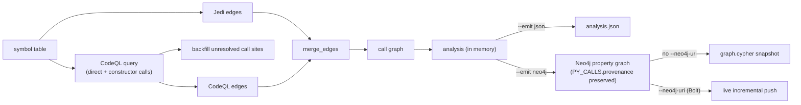

import { Aside, LinkCard, CardGrid } from "@astrojs/starlight/components";

By default the call graph comes entirely from Jedi's lexical analysis. That's fast and needs no external tooling, but lexical resolution can't see every edge — calls through dynamic dispatch, RPC, and some third-party boundaries slip past it. Passing `--codeql` adds a second engine that resolves those, then merges its edges with Jedi's.

<Aside type="caution" title="Experimental">
CodeQL integration is experimental. It deepens resolution at the cost of a slower first run and a larger cache.
</Aside>

## What it adds

With `--codeql`, `canpy` does two extra things:

- **Resolves additional edges** — including RPC, third-party, and dynamically-dispatched targets — tagged `provenance=["codeql"]`, and merges them with the Jedi-derived edges. An edge both engines see carries both provenance tokens.
- **Backfills call sites** — where Jedi left a `PyCallsite.callee_signature` unresolved, CodeQL fills it in. The single CodeQL query is shared (cached on the analysis instance), so this costs no extra database work.

The merged call graph is what every output target sees, so the deeper edges flow through whichever way you emit. When you project to Neo4j with `--emit neo4j`, each `PY_CALLS` relationship carries its `provenance` array, so a CodeQL-only edge is queryable as such, and a target CodeQL resolves but Jedi never saw surfaces as a `:PyExternal` ghost node.

## How it runs

The first time you enable CodeQL on a project, `canpy` sets up everything it needs under the cache directory:

1. **CLI binary.** It looks for a binary in `<cache-dir>/codeql/bin/`, then for `codeql` on your `PATH`, and otherwise **downloads** the CLI into `<cache-dir>/codeql/bin/`. The project-local copy is preferred over `PATH` so the version it installed stays deterministic.
2. **Query library pack.** The CLI install ships only the language extractors, so `canpy` materializes a small `qlpack.yml` depending on `codeql/python-all` and runs `codeql pack install` once — colocating the temporary query inside that pack so `import python` resolves cleanly.
3. **Database.** It builds a CodeQL database for the project under `<cache-dir>/codeql/<project>-db`.

<Aside type="note" title="You don't install CodeQL yourself">
There's no separate CodeQL setup step. The CLI, the pack, and the database are all provisioned and cached automatically on first use.
</Aside>

## Database caching

The CodeQL database is keyed by a checksum over all `.py` files in the project. On a later run, `canpy` reuses the cached database when the checksum still matches and the `db-python` directory exists; otherwise it rebuilds. `--eager` forces a rebuild regardless.

## The resolution ladder

CodeQL and Jedi describe the same definitions slightly differently, so CodeQL endpoints have to be mapped back into Jedi's `PyCallable.signature` space. `canpy` uses a resolution ladder rather than a brittle exact match:

1. **Exact** `(file, start_line)` match.
2. **Same `(file, short_name)`** — if there's a single candidate, take it; otherwise pick the nearest `start_line` among those whose parameter count matches CodeQL's positional arity.
3. **No match** — the caller is skipped, or the callee becomes a ghost node (as it would have been without CodeQL).

This matters because CodeQL and Jedi often disagree on a definition's start line — commonly for decorated functions, where an exact-only join would silently drop the edge. The CodeQL query emits each endpoint's function name and positional arity to drive the tiebreak. (Jedi's parameter count includes `*args`/`**kwargs`/keyword-only slots while CodeQL's arity is positional only, so the arity filter is exact for plain signatures and yields to the nearest-line tiebreak otherwise.)

## Graceful degradation

If CodeQL extraction fails for any reason, `canpy` logs a warning and falls back to the Jedi-only call graph — the run still completes and still produces a valid artifact. CodeQL deepens the graph; it never gates it.

## Where to go next

<CardGrid>
  <LinkCard title="Core concepts" description="How Jedi and CodeQL edges are merged into one graph." href="/codeanalyzer-python/guides/concepts/#call-graph" />
  <LinkCard title="CLI usage" description="Combining --codeql with caching and output formats." href="/codeanalyzer-python/guides/cli-usage/#enabling-codeql" />
  <LinkCard title="Output schema" description="The provenance and tags fields on PyCallEdge." href="/codeanalyzer-python/reference/schema/#pycalledge" />
</CardGrid>
