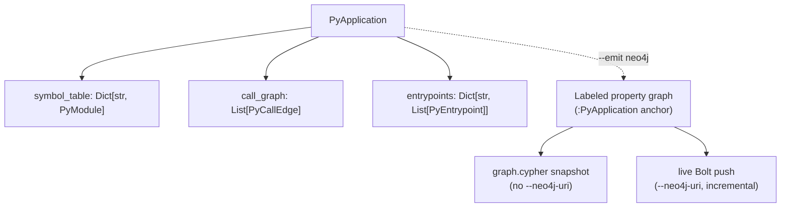
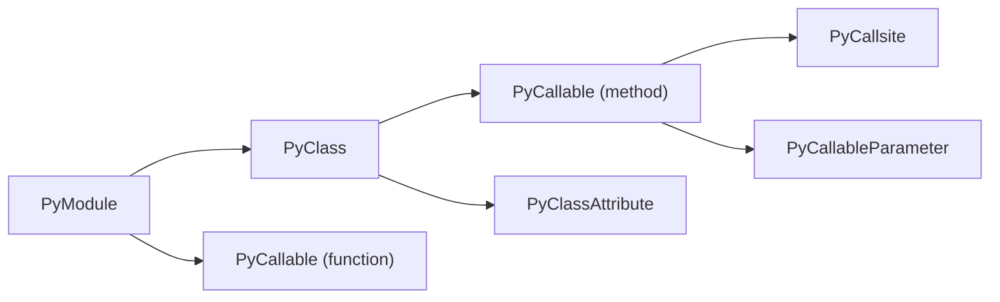
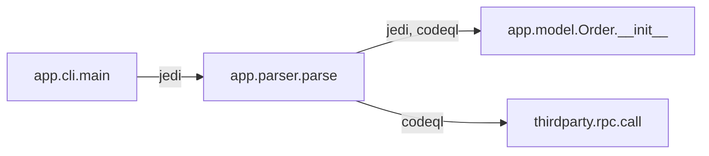
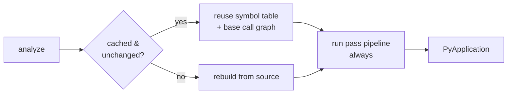

import { Aside, LinkCard, CardGrid, Tabs, TabItem } from "@astrojs/starlight/components";

Every run produces one `PyApplication` — a typed model of a project with three top-level pieces: a **symbol table**, a **call graph**, and **entrypoints**. This page explains what each contains, how the pipeline builds them, the two cross-cutting ideas you'll meet everywhere — **provenance** and the **analysis cache** — and how that same in-memory model projects into a **Neo4j property graph** when you ask for it.



## Symbol table

The **symbol table** is the structured inventory of the project: one `PyModule` per source file, each holding its imports, classes, functions, and module-level variables. It's the foundation every other piece is built on, and it's what you get even on the cheapest run.



A `PyCallable` (function or method) carries its `signature`, source `code`, `parameters`, `decorators`, `call_sites`, accessed symbols, cyclomatic complexity, and nested callables/classes. A `PyClass` carries its `base_classes`, `methods`, `attributes`, and decorators. Each node records line/column spans so you can map any element back to source.

Construction is done by Jedi (for type and reference resolution) over a Tree-sitter / `ast` walk. Because Jedi resolves against the project's own installed dependencies, `canpy` builds an isolated virtual environment per project first. In CI, containers, and sandboxed runs where that's redundant, `--no-venv` resolves against the ambient interpreter instead.

<Aside type="note" title="Signatures are the identity">
A callable's `signature` (e.g. `my_pkg.parser.Parser.parse`) is its identity across the whole artifact. Call-graph edges and entrypoints both reference callables by signature, not by a separate node object. The same signatures become the merge keys when the model is projected into Neo4j.
</Aside>

## Call graph

The **call graph** records who-calls-whom as a flat list of `PyCallEdge` objects. Each edge is identity-only: a `source` signature, a `target` signature, a `weight`, and a `provenance` list. The nodes of the graph are the `PyCallable` entries already in the symbol table — there's no separate vertex type. Rich per-call detail (receiver, argument types, location) lives on the `PyCallsite` entries inside each callable.



Because it's a plain edge list keyed by signature, loading it into `networkx` is direct:

```python
import json, networkx as nx

app = json.load(open("analysis.json"))
g = nx.DiGraph()
for e in app["call_graph"]:
    g.add_edge(e["source"], e["target"])

nx.has_path(g, entry_sig, sink_sig)   # reachability — a query, not a guess
```

### How the graph is built

Every run builds the graph in four steps — CodeQL participates only when `--codeql` is passed:

1. **CodeQL resolution** (if enabled) produces resolved edges tagged `provenance=["codeql"]` and backfills `callee_signature` on call sites Jedi couldn't resolve.
2. **Constructor fallback** — a heuristic walks the symbol table by class short-name and scope to fill in constructor calls neither Jedi nor CodeQL resolved (common for classes nested inside functions), synthesizing `<class>.__init__` targets.
3. **Jedi edges** are derived from the now-fully-augmented symbol table, reflecting every resolution it contains.
4. **Merge** — Jedi and CodeQL edges are unioned; an edge both engines saw carries both provenance tokens.

<Aside type="note" title="Ghost nodes">
When an edge's endpoint isn't in the symbol table — a call into a third-party library or an RPC target — `canpy` keeps the edge anyway, with the endpoint as a *ghost node*. That preserves cross-boundary call structure instead of silently dropping it. In the Neo4j projection these ghosts are materialized authoritatively as `:PyExternal` nodes (see [From artifact to property graph](#from-artifact-to-property-graph)).
</Aside>

## Provenance

Every `PyCallEdge` carries a `provenance` list recording which engine(s) produced it: `"jedi"`, `"codeql"`, or an extension's own token (e.g. `"odoo_orm_dispatch"`). It's an **open vocabulary** — a stored `analysis.json` round-trips no matter which engines or passes were installed when it was written. Provenance lets a consumer weigh edges by confidence, or filter to a single engine's view. The projection carries it through: a `PY_CALLS` relationship keeps `weight` and the full `provenance` string array.

## Entrypoints

**Entrypoints** are the framework-dispatched roots of an application — the functions a framework calls that your own code never calls directly: a Flask route handler, a Celery task, a Click command, a gRPC servicer method. They're collected into `entrypoints`, keyed by framework name, with each `PyEntrypoint` referencing a callable by signature and carrying framework metadata (route path, HTTP methods, task name, …).

Entrypoints matter because reachability is only meaningful from a real root. "Is this sink reachable?" becomes answerable once you know where execution actually *enters* the program. See [Entrypoint detection](/codeanalyzer-python/guides/entrypoints/).

## The analysis cache

Analysis is **lazy** by default. `canpy` stores its results under `.codeanalyzer/` and, on the next run, reuses the cached entry for any file whose mtime, size, and content hash are unchanged — only new or modified files are re-analyzed. `--eager` forces a full rebuild; `--clear-cache` deletes the cache on exit.

Crucially, **only the symbol table and base call graph are cached.** The pass-pipeline output — entrypoints and synthetic edges — is recomputed on every run, so it can never go stale when an extension is added, changed, or removed.



The same per-file content hash that drives this cache also drives the incremental Neo4j push: a `PyModule` carries its `content_hash`, and a live Bolt push compares it against the hash already in the database so only changed modules are rewritten.

## From artifact to property graph

`analysis.json` is one self-contained file: to query it you load the whole thing into memory and walk it. That's fine for a single project and a non-starter across a portfolio. `--emit neo4j` projects the *same* in-memory `PyApplication` — same symbol table, same call graph — into a **labeled property graph** so many applications can live in one database and you query across all of them with Cypher instead of parsing giant JSON blobs.

The projection is a faithful mapping, not a new analysis:

- **Labels are namespaced.** Every node label is `Py`-prefixed and every relationship type is `PY_`-prefixed — `:PyModule`, `:PyClass`, `:PyCallable`, `PY_CALLS`, `PY_DECLARES` — so the Java (`:J*` / no prefix) and TypeScript analyzers can share one database without label or relationship-type collisions.
- **Declarations are keyed by signature.** `:PyClass`, `:PyCallable`, and `:PyExternal` are all `MERGE`d under a shared `:PySymbol` label keyed by `signature` — the very identity used in the symbol table and call graph. That's what lets call edges, inheritance, and declaration containment reference a symbol without duplicating it.
- **Ghost nodes become `:PyExternal`.** The third-party and RPC endpoints that the in-memory model keeps as *ghost nodes* are materialized authoritatively as `:PyExternal` nodes (carrying `name` and `module`). A `PyCallSite` resolves via `PY_RESOLVES_TO` to either a real `:PyCallable` or an external, and `PY_CALLS` edges to externals survive the projection.
- **One application, one anchor.** Everything hangs off a single `:PyApplication` node whose `name` is your `--app-name` (defaulting to the input directory's basename). The node also carries `schema_version` — currently `1.1.0` — so a consumer can check the contract it's reading against.

<Aside type="note" title="Shared nodes across applications">
`:PyExternal`, `:PyPackage`, and `:PyDecorator` are `MERGE`-only and not owned by any one application, so the same third-party package or decorator referenced by ten services is a single node in the database — not ten copies.
</Aside>

### Snapshot vs. incremental Bolt

`--emit neo4j` has two sub-modes, decided solely by whether `--neo4j-uri` is set:

<Tabs>
<TabItem label="Snapshot (graph.cypher)">

Without `--neo4j-uri`, `canpy` writes a self-contained `graph.cypher` to the output directory: constraints and indexes, a **scoped wipe** of this application's prior subtree, then batched `UNWIND … MERGE` for nodes and edges. It needs no extra dependencies and expresses the **full truth** of the analysis (it is *not* incremental). Load it with `cypher-shell`:

```bash
canpy --input ./my-python-project --emit neo4j --app-name my-service --output ./out
cypher-shell < ./out/graph.cypher
```

The wipe is scoped to `MATCH (a:PyApplication {name: "my-service"})` and its module subtree, so reloading one application never touches another's data in a shared database.

</TabItem>
<TabItem label="Live Bolt (incremental)">

With `--neo4j-uri`, `canpy` pushes to a live Neo4j over Bolt **incrementally**: it ensures the schema (constraints + indexes), diffs each module's `content_hash` against the database, and rewrites only the modules that changed. Shared `:PyExternal` / `:PyPackage` / `:PyDecorator` nodes are `MERGE`-only and nodes are never blindly deleted, so cross-module references survive. On a **full run** (no `--file-name`), modules whose source file vanished are pruned — and that prune is scoped to this application's `:PyApplication` anchor, so pushing one app can't delete another app's modules.

This path needs the optional `neo4j` driver extra:

```bash
pip install 'codeanalyzer-python[neo4j]'
```

Prefer the `NEO4J_PASSWORD` environment variable over `--neo4j-password` — the flag is visible in shell history and the process list. `NEO4J_URI`, `NEO4J_USERNAME`, and `NEO4J_DATABASE` are read the same way (an explicit flag wins when set):

```bash
export NEO4J_PASSWORD=secret
canpy --input ./my-python-project --emit neo4j --app-name my-service \
  --neo4j-uri bolt://localhost:7687 --neo4j-user neo4j
```

</TabItem>
</Tabs>

<Aside type="tip" title="Read it back without re-analyzing">
Because `--app-name` becomes the `:PyApplication.name` anchor, a consumer can reconstruct exactly this application's typed model from the graph — no JDK, no native binary, no project source needed — by pointing the CLDK Python SDK at the same name:

```python
from cldk import CLDK
from cldk.analysis.commons.backend_config import Neo4jConnectionConfig

analysis = CLDK.python(
    backend=Neo4jConnectionConfig(
        uri="bolt://localhost:7687",
        username="neo4j",
        password="neo4j",
        application_name="my-service",  # matches canpy --app-name
    ),
)
cg = analysis.get_call_graph()   # the same networkx.DiGraph as the in-process backend
```

The `application_name` must match the `--app-name` the graph was loaded with. See the [Neo4j guide](/codeanalyzer-python/guides/neo4j/) for the full producer/consumer story.
</Aside>

## Where to go next

<CardGrid>
  <LinkCard title="Output schema" description="Every field of every model in the artifact." href="/codeanalyzer-python/reference/schema/" />
  <LinkCard title="Neo4j property graph" description="Project the analysis into a queryable graph and read it back." href="/codeanalyzer-python/guides/neo4j/" />
  <LinkCard title="Graph schema reference" description="Every node label, relationship type, and property." href="/codeanalyzer-python/reference/graph-schema/" />
  <LinkCard title="CodeQL analysis" description="What the second engine adds and how it's resolved." href="/codeanalyzer-python/guides/codeql/" />
  <LinkCard title="Entrypoint detection" description="The frameworks codeanalyzer recognizes." href="/codeanalyzer-python/guides/entrypoints/" />
  <LinkCard title="Analysis passes" description="Add your own entrypoints and synthetic edges." href="/codeanalyzer-python/extending/analysis-passes/" />
</CardGrid>
