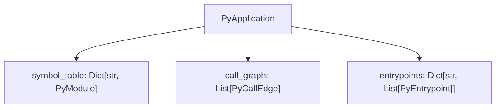
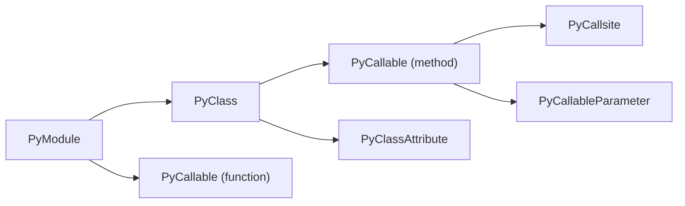
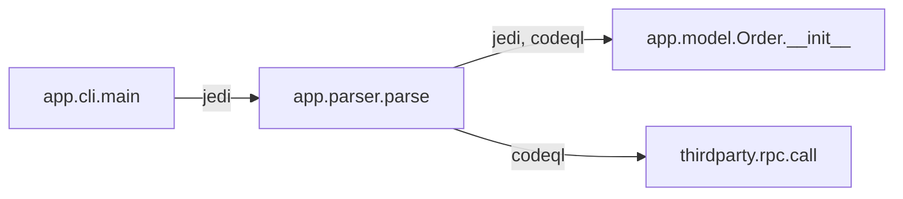
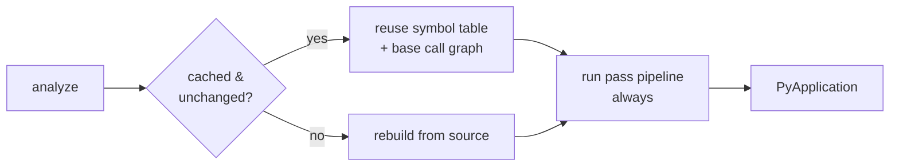

import { Aside, LinkCard, CardGrid, Tabs, TabItem } from "@astrojs/starlight/components";

Every run produces one `PyApplication` — a typed model of a project with three top-level pieces: a **symbol table**, a **call graph**, and **entrypoints**. This page explains what each contains, how the pipeline builds them, and the two cross-cutting ideas you'll meet everywhere: **provenance** and the **analysis cache**.



## Symbol table

The **symbol table** is the structured inventory of the project: one `PyModule` per source file, each holding its imports, classes, functions, and module-level variables. It's the foundation every other piece is built on, and it's what you get even on the cheapest run.



A `PyCallable` (function or method) carries its `signature`, source `code`, `parameters`, `decorators`, `call_sites`, accessed symbols, cyclomatic complexity, and nested callables/classes. A `PyClass` carries its `base_classes`, `methods`, `attributes`, and decorators. Each node records line/column spans so you can map any element back to source.

Construction is done by Jedi (for type and reference resolution) over a Tree-sitter / `ast` walk. Because Jedi resolves against the project's own installed dependencies, that's why codeanalyzer builds an isolated virtual environment per project first.

<Aside type="note" title="Signatures are the identity">
A callable's `signature` (e.g. `my_pkg.parser.Parser.parse`) is its identity across the whole artifact. Call-graph edges and entrypoints both reference callables by signature, not by a separate node object.
</Aside>

## Call graph

The **call graph** records who-calls-whom as a flat list of `PyCallEdge` objects. Each edge is identity-only: a `source` signature, a `target` signature, a `weight`, and a `provenance` list. The nodes of the graph are the `PyCallable` entries already in the symbol table — there's no separate vertex type. Rich per-call detail (receiver, argument types, location) lives on the `PyCallsite` entries inside each callable.



Because it's a plain edge list keyed by signature, loading it into `networkx` is direct:

```python
import json, networkx as nx

app = json.load(open("analysis.json"))
g = nx.DiGraph()
for e in app["call_graph"]:
    g.add_edge(e["source"], e["target"])

nx.has_path(g, entry_sig, sink_sig)   # reachability — a query, not a guess
```

### How the graph is built

Every run builds the graph in four steps — CodeQL participates only when `--codeql` is passed:

1. **CodeQL resolution** (if enabled) produces resolved edges tagged `provenance=["codeql"]` and backfills `callee_signature` on call sites Jedi couldn't resolve.
2. **Constructor fallback** — a heuristic walks the symbol table by class short-name and scope to fill in constructor calls neither Jedi nor CodeQL resolved (common for classes nested inside functions), synthesizing `<class>.__init__` targets.
3. **Jedi edges** are derived from the now-fully-augmented symbol table, reflecting every resolution it contains.
4. **Merge** — Jedi and CodeQL edges are unioned; an edge both engines saw carries both provenance tokens.

<Aside type="note" title="Ghost nodes">
When an edge's endpoint isn't in the symbol table — a call into a third-party library or an RPC target — codeanalyzer keeps the edge anyway, with the endpoint as a *ghost node*. That preserves cross-boundary call structure instead of silently dropping it.
</Aside>

## Provenance

Every `PyCallEdge` carries a `provenance` list recording which engine(s) produced it: `"jedi"`, `"codeql"`, or an extension's own token (e.g. `"odoo_orm_dispatch"`). It's an **open vocabulary** — a stored `analysis.json` round-trips no matter which engines or passes were installed when it was written. Provenance lets a consumer weigh edges by confidence, or filter to a single engine's view.

## Entrypoints

**Entrypoints** are the framework-dispatched roots of an application — the functions a framework calls that your own code never calls directly: a Flask route handler, a Celery task, a Click command, a gRPC servicer method. They're collected into `entrypoints`, keyed by framework name, with each `PyEntrypoint` referencing a callable by signature and carrying framework metadata (route path, HTTP methods, task name, …).

Entrypoints matter because reachability is only meaningful from a real root. "Is this sink reachable?" becomes answerable once you know where execution actually *enters* the program. See [Entrypoint detection](/codeanalyzer-python/guides/entrypoints/).

## The analysis cache

Analysis is **lazy** by default. codeanalyzer stores its results under `.codeanalyzer/` and, on the next run, reuses the cached entry for any file whose mtime, size, and content hash are unchanged — only new or modified files are re-analyzed. `--eager` forces a full rebuild; `--clear-cache` deletes the cache on exit.

Crucially, **only the symbol table and base call graph are cached.** The pass-pipeline output — entrypoints and synthetic edges — is recomputed on every run, so it can never go stale when an extension is added, changed, or removed.



## Where to go next

<CardGrid>
  <LinkCard title="Output schema" description="Every field of every model in the artifact." href="/codeanalyzer-python/reference/schema/" />
  <LinkCard title="CodeQL analysis" description="What the second engine adds and how it's resolved." href="/codeanalyzer-python/guides/codeql/" />
  <LinkCard title="Entrypoint detection" description="The frameworks codeanalyzer recognizes." href="/codeanalyzer-python/guides/entrypoints/" />
  <LinkCard title="Analysis passes" description="Add your own entrypoints and synthetic edges." href="/codeanalyzer-python/extending/analysis-passes/" />
</CardGrid>
