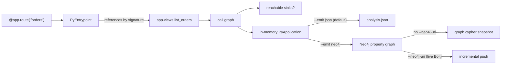
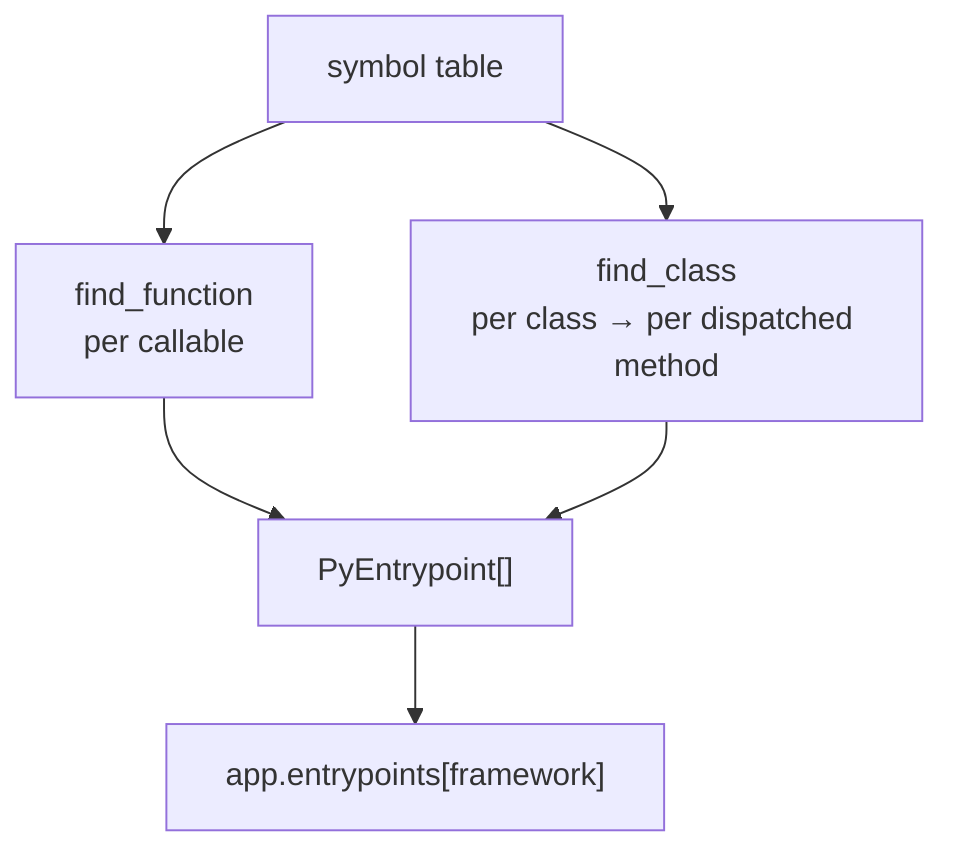

import { Aside, Badge, LinkCard, CardGrid } from "@astrojs/starlight/components";

<p>
  <Badge text="Work in progress" variant="caution" />{" "}
  <Badge text="Help wanted" variant="note" />
</p>

<Aside type="caution" title="Design, not shipped behavior">
The `PyEntrypoint` schema and the `AbstractEntrypointFinder` contract described here are implemented, but **no concrete finder ships yet** — `BUILTIN_PASS_FACTORIES` is empty. Until a finder is written, `PyApplication.entrypoints` comes back empty for every framework. Read this page as the shape finders target and the API you'd write one against, not as detection that runs out of the box. See [Extending → Overview](/codeanalyzer-python/extending/overview/).
</Aside>

An **entrypoint** is a function the framework calls that your own code never calls directly: a Flask route handler, a FastAPI endpoint, a Celery task, a Click command, a gRPC servicer method. Static call-graph analysis can't see these edges — the framework wires them up at runtime — so without help, those handlers look like dead code, and reachability from "where execution actually enters" is unanswerable.

codeanalyzer-python is designed to surface entrypoints with a layer modeled on **JackEE** (Antoniadis et al., PLDI 2020) — the same framework-independent entrypoint architecture the Java analyzer uses. Each detected root becomes a `PyEntrypoint` in `PyApplication.entrypoints`, keyed by framework name. The detection sources and framework-specific fields below define what a finder *can* record; which of them are populated depends entirely on which finders are installed.



## What a PyEntrypoint carries

Each entrypoint *references* a `PyCallable` by signature (the callable itself stays in the symbol table) and records how it was detected and what the framework knows about it:

| Field | Meaning |
| --- | --- |
| `signature` | The callable this entrypoint refers to. |
| `framework` | The framework that dispatches it (`"flask"`, `"celery"`, …). |
| `detection_source` | *How* it was found — see below. |
| `route_path`, `http_methods` | For HTTP routes. |
| `celery_task_name`, `cli_command_name`, `lambda_handler_key`, `grpc_service_name` | Framework-specific identifiers, populated when applicable. |
| `source_file` | The file declaring the binding (`urls.py`, `template.yaml`, …). |
| `tags` | Free-form, namespaced metadata for extensions (e.g. an auth guard an LLM needs to judge exploitability). |

## Detection sources

The `detection_source` field records the *mechanism* by which a root was found. Finders recognize several:

- **`decorator`** — decorator-bound handlers: Flask `@app.route`, FastAPI `@router.get`, Celery `@shared_task`, Click `@cli.command`.
- **`base_class`** — inheritance-based dispatch where the framework invokes specific methods on a subclass: Tornado `RequestHandler.get`/`post`, Django class-based views, gRPC `Servicer` RPC methods.
- **`url_resolver`** — Django `path()` / `re_path()` / `url()` / `include()` tables.
- **`router_mount`** — FastAPI `app.include_router` / `app.mount`.
- **`blueprint`** — Flask `register_blueprint`.
- **`lambda_template`** — AWS SAM / `serverless.yml` handler bindings.
- **`typer_subapp`**, **`click_add_command`**, **`argparse_dispatch`** — CLI dispatch wiring.
- **`convention`** — convention-bound roots like the AWS Lambda `def handler(event, context)` shape.
- **`extension`** — emitted by an out-of-tree pass (see [Analysis passes](/codeanalyzer-python/extending/analysis-passes/)).

<Aside type="note" title="Open vocabulary">
Like edge provenance, `detection_source` is an open string. Core never interprets pass-defined tokens, so a persisted `analysis.json` round-trips regardless of which finders were installed when it was written.
</Aside>

## Function vs class detection

A finder implements two predicates, mirroring JackEE:

- **`find_function`** — for decorator-, convention-, and binding-bound roots (Flask, FastAPI, Celery, Click, Django function views resolved via `urls.py`, the Lambda handler convention).
- **`find_class`** — for inheritance-based dispatch, returning **one entrypoint per framework-dispatched method**. A Tornado `RequestHandler` subclass expands into separate entrypoints for `get`, `post`, and so on.



## Why it matters for reachability

Once entrypoints are known, "is this sink reachable?" has a real starting set. You seed a graph traversal from entrypoint signatures and ask whether a path reaches the sink — confirming or refuting a scanner alert with a `networkx` query instead of a guess:

```python
import networkx as nx

roots = [ep["signature"]
         for eps in app["entrypoints"].values()
         for ep in eps]

reachable = any(nx.has_path(g, root, sink_sig) for root in roots if root in g)
```

<Aside type="note" title="Entrypoints stay in analysis.json — they are not projected to Neo4j">
The Neo4j property graph (`canpy --emit neo4j`) projects the symbol table and call graph — `:PyModule`, `:PyClass`, `:PyCallable`, `:PyCallSite`, the `PY_CALLS` edges, and so on. There is **no `:PyEntrypoint` label or `PY_*` relationship** for entrypoints in the schema; the catalog declares none. Entrypoints live only in `analysis.json` today. So reachability-from-roots is a JSON-side concern: read `app["entrypoints"]` for the seed set and run the `networkx` traversal above against the call graph — whether that call graph came from `analysis.json` or was reconstructed from the graph via the CLDK Neo4j backend. See [Neo4j graph schema](/codeanalyzer-python/reference/neo4j-schema/) for the labels and relationships that *are* projected.
</Aside>

## Extending detection

Entrypoint finding is one *kind* of analysis pass. To recognize a framework codeanalyzer doesn't cover, write an `AbstractEntrypointFinder` and register it via the `codeanalyzer.analysis_passes` entry-point group — no fork required. See [Analysis passes](/codeanalyzer-python/extending/analysis-passes/).

## Where to go next

<CardGrid>
  <LinkCard title="Analysis passes" description="Write a finder for a new framework, or synthesize edges." href="/codeanalyzer-python/extending/analysis-passes/" />
  <LinkCard title="Output schema" description="The full PyEntrypoint model." href="/codeanalyzer-python/reference/schema/#pyentrypoint" />
  <LinkCard title="Core concepts" description="How entrypoints fit alongside the symbol table and call graph." href="/codeanalyzer-python/guides/concepts/#entrypoints" />
</CardGrid>
