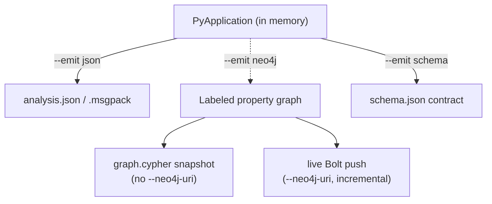
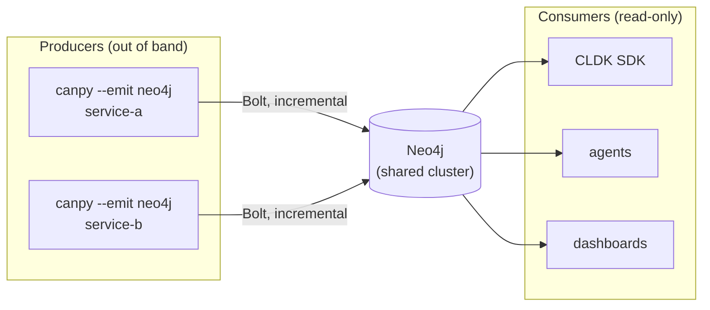

import Neo4jPropertyGraph from '../../../components/Neo4jPropertyGraph.astro';
import { Aside, LinkCard, CardGrid, Tabs, TabItem, Steps } from "@astrojs/starlight/components";

`analysis.json` is one self-contained file: to query it you load the whole thing into memory and walk it. That works for a single project and falls over across a portfolio. `--emit neo4j` projects the *same* in-memory `PyApplication` — same symbol table, same call graph — into a **labeled property graph**, so many applications live in one database and you query across all of them with Cypher instead of parsing giant JSON blobs.

<Neo4jPropertyGraph />

This guide covers both ways to populate that graph (a self-contained snapshot and a live incremental push), how `--app-name` keeps many applications safely in one database, the version-stamped schema contract, and how the [CLDK](https://github.com/codellm-devkit/python-sdk) Python SDK reads the graph back without re-analyzing anything. For the full node-and-relationship topology, see the [output schema reference](/codeanalyzer-python/reference/schema/).

## The projection

`--emit neo4j` is an *alternative* to the default `analysis.json`, selected by the `--emit` enum: `canpy` builds one analysis in memory and then projects it. The mapping is faithful — it is the same model, not a new analysis:

- **Labels are namespaced.** Every node label is `Py`-prefixed and every relationship type is `PY_`-prefixed — `:PyModule`, `:PyClass`, `:PyCallable`, `PY_CALLS`, `PY_DECLARES` — so the Java, TypeScript, and Python analyzers can share one database without label or relationship-type collisions.
- **Declarations are keyed by signature.** `:PyClass`, `:PyCallable`, and `:PyExternal` are all `MERGE`d under a shared `:PySymbol` label keyed by `signature` — the very identity used in the symbol table and call graph. That is what lets call edges, inheritance, and declaration containment reference a symbol without duplicating it.
- **Ghost nodes become `:PyExternal`.** Third-party and RPC endpoints that the in-memory model keeps as *ghost nodes* are materialized authoritatively as `:PyExternal` nodes, carrying `name` and `module`. A `PyCallSite` resolves via `PY_RESOLVES_TO` to either a real `:PyCallable` or an external, and `PY_CALLS` edges to externals survive the projection.
- **One application, one anchor.** Everything hangs off a single `:PyApplication` node whose `name` is your `--app-name`. That node also carries `schema_version` so a consumer can check the contract it is reading against.



## Producer and consumer

The graph splits analysis into two independent halves. The **producer** is a `canpy --emit neo4j` run — the heavy step that walks source, resolves with Jedi (and optionally CodeQL), and writes the graph. It runs out of band: a CI step, or a Kubernetes Job or CronJob on each commit, pushing app-scoped subgraphs over Bolt into a shared Neo4j.

The **consumers** — agents, dashboards, and the CLDK Python SDK — are lightweight read-only clients. They never run the analyzer; they only query the graph. Because the push is incremental and app-scoped, many producer jobs write into one cluster while many consumers fan out from it, and the two scale independently.



## The application anchor: `--app-name`

`--app-name` sets the name of the single `:PyApplication` root node for this graph. It is the merge key (uniqueness-constrained), and everything else hangs off it via `PY_HAS_MODULE`. When omitted it defaults to the basename of the resolved `--input` directory:

```bash
canpy --input ./my-service --emit neo4j --app-name my-service
# the :PyApplication anchor is named "my-service"
```

The anchor name also **scopes every graph mutation**, which is what makes one shared database multi-tenant by construction — applications never clobber each other:

- The `graph.cypher` snapshot wipes only `(:PyApplication {name: <app>})` and its module subtree before reloading.
- The Bolt orphan prune on a full run is scoped to `(:PyApplication {name: $app})-[:PY_HAS_MODULE]->(:PyModule)`, so pushing app B never deletes app A's modules.

`--app-name` is also the value the [CLDK Python SDK](#reading-the-graph-back) matches via `application_name` to read back exactly this app's subgraph. **Keep `--app-name` (CLI) and `application_name` (SDK) identical.**

<Aside type="note" title="Shared nodes across applications">
`:PyExternal`, `:PyPackage`, and `:PyDecorator` are `MERGE`-only and not owned by any one application, so the same third-party package or decorator referenced by ten services is a *single* node in the database — not ten copies. Cross-service queries (which apps import `requests`? who depends on this package?) become one traversal.
</Aside>

## Two ways to populate it

`--emit neo4j` has two sub-modes, decided solely by whether `--neo4j-uri` is set.

<Tabs>
<TabItem label="Snapshot (graph.cypher)">

Without `--neo4j-uri`, `canpy` writes a self-contained `graph.cypher` file: the constraints and indexes, a scoped `DETACH DELETE` of this app's prior subgraph, then batched `UNWIND … MERGE` statements for every node and edge. It needs **no extra dependencies** and expresses the **full truth** of the analysis (it is *not* incremental). With `--output` the file lands in that directory; otherwise it is written to the current directory.

```bash
canpy --input ./my-service --emit neo4j --app-name my-service --output ./out
# -> ./out/graph.cypher
```

Load it into Neo4j with `cypher-shell`:

```bash
cypher-shell -u neo4j -p "$NEO4J_PASSWORD" < ./out/graph.cypher
```

This path is ideal for committing a reproducible snapshot as a CI artifact, seeding a local database, or loading a graph offline with no driver installed.

</TabItem>
<TabItem label="Live push (Bolt, incremental)">

With `--neo4j-uri`, `canpy` pushes to a live Neo4j over Bolt **incrementally**. It ensures the DDL, diffs each module's `content_hash` against what is already in the database, and rewrites only the modules that changed — the same per-file content hash that drives the [analysis cache](/codeanalyzer-python/guides/concepts/#the-analysis-cache). Shared `:PyExternal` / `:PyPackage` / `:PyDecorator` nodes are `MERGE`-only and nodes are never blindly deleted, so cross-module references survive. On a **full run** (no `--file-name`), modules whose source file vanished are pruned — and that prune is scoped to this app's `:PyApplication` anchor.

The live push needs the optional `neo4j` driver. Install the extra:

```bash
pip install 'codeanalyzer-python[neo4j]'
```

<Aside type="caution">
If the driver is missing, the Bolt path raises a clear `RuntimeError` telling you to run the install above. The `graph.cypher` snapshot and `--emit schema` need nothing extra.
</Aside>

Point `--neo4j-uri` at the server. **Prefer the `NEO4J_PASSWORD` environment variable** over `--neo4j-password` — the flag is visible in your shell history and the process list:

```bash
export NEO4J_URI=bolt://neo4j.internal:7687
export NEO4J_USERNAME=neo4j
export NEO4J_PASSWORD=secret

canpy --input ./my-service --emit neo4j --app-name my-service
```

Each connection flag falls back to a standard environment variable when omitted (an explicit flag wins):

| Flag | Env var | Default |
| --- | --- | --- |
| `--neo4j-uri` | `NEO4J_URI` | — (omit to write `graph.cypher`) |
| `--neo4j-user` | `NEO4J_USERNAME` | `neo4j` |
| `--neo4j-password` | `NEO4J_PASSWORD` | `neo4j` |
| `--neo4j-database` | `NEO4J_DATABASE` | server default |

So a push that pins the database explicitly (password still via the environment) looks like this:

```bash
canpy \
  --input ./my-service \
  --emit neo4j \
  --app-name my-service \
  --neo4j-uri bolt://neo4j.internal:7687 \
  --neo4j-user neo4j \
  --neo4j-database analysis
```

</TabItem>
</Tabs>

### Targeted pushes skip pruning

On a Bolt push, adding `--file-name` makes the run **targeted** rather than a full run. A targeted run rewrites only that file's module and **skips orphan pruning** — modules for deleted files are *not* removed. A full run (no `--file-name`) enables pruning of vanished modules.

```bash
# Targeted: re-push one changed file, leave everything else (no pruning)
canpy --input ./my-service --emit neo4j --app-name my-service \
  --neo4j-uri bolt://localhost:7687 --file-name src/app/routes.py

# Full run: re-analyze the whole project and prune modules whose files are gone
canpy --input ./my-service --emit neo4j --app-name my-service \
  --neo4j-uri bolt://localhost:7687
```

A natural pattern is a targeted push per changed file in a fast pre-merge hook, and a scheduled full run that reconciles deletions.

## Running it as a Kubernetes job

Because the analyzer is the producer half and writes app-scoped subgraphs, it fits a `Job` (one-shot reconciliation) or a `CronJob` (periodic re-analysis) that pushes over Bolt into a managed or clustered Neo4j. Supply the connection through the standard environment variables — read the password from a Secret so it never lands on the command line:

```yaml
apiVersion: batch/v1
kind: CronJob
metadata:
  name: analyze-my-service
spec:
  schedule: "*/30 * * * *"
  jobTemplate:
    spec:
      template:
        spec:
          restartPolicy: Never
          containers:
            - name: canpy
              image: ghcr.io/codellm-devkit/codeanalyzer-python:latest
              args:
                - --input=/src
                - --emit=neo4j
                - --app-name=my-service
                - --no-venv
                - -v
              env:
                - name: NEO4J_URI
                  value: bolt://neo4j.data:7687
                - name: NEO4J_USERNAME
                  value: neo4j
                - name: NEO4J_PASSWORD
                  valueFrom:
                    secretKeyRef:
                      name: neo4j-auth
                      key: password
              volumeMounts:
                - name: source
                  mountPath: /src
          volumes:
            - name: source
              # a checkout of the project under analysis
              emptyDir: {}
```

`--no-venv` resolves imports against the ambient interpreter instead of building a per-project virtualenv, which is the right default in a container where dependencies are already installed. Each app's CronJob writes only its own anchored subgraph, so dozens of services can target one Neo4j cluster; give the analyzer write credentials and your consumers read-only ones.

<Aside type="tip" title="High availability">
Neo4j Aura, Enterprise, and causal clustering give the shared graph HA and read replicas. Producer jobs write to the leader over Bolt; read-only consumers spread across replicas. The graph becomes governed infrastructure your tools can depend on, rather than a JSON blob each tool re-derives.
</Aside>

## The schema contract

Every graph carries a `schema_version` stamped on its `:PyApplication` node — currently **`1.1.0`** — so a consumer can check the contract before it reads. The machine-readable contract itself is project-independent, so you can publish it without running any analysis:

```bash
# Print the schema contract to stdout...
canpy --emit schema

# ...or write it to a directory as schema.json
canpy --emit schema --output ./out
# -> ./out/schema.json
```

`schema.json` enumerates every node label, relationship type, and property the emitter can produce. It is checked into the repository as `schema.neo4j.json` and shipped as a GitHub Release asset, so a downstream tool can pin the version it was built against. See the [output schema reference](/codeanalyzer-python/reference/schema/) for the data model behind it.

## Reading the graph back

Once the graph is populated, the [CLDK](https://github.com/codellm-devkit/python-sdk) Python SDK reads it back **without re-analyzing** — no JDK, no native binary, and no project source on the consumer. The graph is produced once, out of band, by the `canpy --emit neo4j` job above; the SDK is a read-only client that only needs the Bolt URI and read-only credentials. This is the enterprise unlock: analysis is produced once, centrally, and read cheaply everywhere.

<Steps>

1. Install the SDK with its driver extra:

   ```bash
   pip install 'cldk[neo4j]'
   ```

2. Pass a `Neo4jConnectionConfig` as the backend. Its `application_name` must match the `--app-name` the graph was loaded with:

   ```python
   from cldk import CLDK
   from cldk.analysis.commons.backend_config import Neo4jConnectionConfig

   analysis = CLDK.python(
       backend=Neo4jConnectionConfig(
           uri="bolt://localhost:7687",
           username="neo4j",
           password="neo4j",              # read-only credentials suffice
           database=None,                 # None => server default
           application_name="my-service", # matches canpy --app-name
       ),
   )

   classes = analysis.get_classes()       # Dict[str, PyClass]
   cg = analysis.get_call_graph()         # networkx.DiGraph keyed by callable signatures
   for sig, cls in classes.items():
       print(sig, list(cls.methods))
   ```

</Steps>

Selecting the backend by the *type* of the `backend=` config is the whole switch: a `Neo4jConnectionConfig` swaps the facade onto the read-only Neo4j backend, while the default config runs the in-process analyzer. The Neo4j backend bulk-fetches nodes and relationships in a handful of Cypher queries and rebuilds the **same** `PyApplication` (the `PyModule` symbol table plus the `PyCallEdge` call graph) and the same `networkx` `DiGraph` the in-process analyzer produces. So `get_symbol_table()`, `get_call_graph()`, `get_modules()`, `get_classes()`, `get_class()`, `get_methods()`, `get_callers()`, `get_callees()`, and `get_imports()` all return the identical typed model objects.

Because the graph is external, `project_path` is **optional** for the Neo4j backend. The backend is a context manager — use `with`, or call `.close()` to release the driver:

```python
with CLDK.python(backend=Neo4jConnectionConfig(
        uri="bolt://localhost:7687",
        application_name="my-service")) as analysis:
    callers = analysis.get_callers("my_pkg.parser.Parser.parse")
```

<Aside type="note">
Reads are scoped to one application by `application_name`. If you leave it unset and give no resolvable `project_path`, the backend raises `application_name is required to scope queries to an application.` Parity with the in-memory backend holds modulo documented projection-lossy fields (for example, comments collapse to a docstring).
</Aside>

<Aside type="note" title="Where this API lives">
`Neo4jConnectionConfig` is part of the [CLDK Python SDK](https://github.com/codellm-devkit/python-sdk), not `codeanalyzer-python` itself. Its `application_name` corresponds to the `--app-name` (i.e. `:PyApplication.name`) the graph was loaded with by `canpy`.
</Aside>

## Querying the graph directly

You do not have to go through the SDK — the graph is plain Cypher. A few examples against the [schema](/codeanalyzer-python/reference/schema/):

```cypher
// All applications in this database and their schema version
MATCH (a:PyApplication)
RETURN a.name AS app, a.schema_version AS schema;

// The most complex callables across the whole portfolio
MATCH (a:PyApplication)-[:PY_HAS_MODULE]->(:PyModule)
      -[:PY_DECLARES*]->(c:PyCallable)
RETURN a.name AS app, c.signature, c.cyclomatic_complexity AS cc
ORDER BY cc DESC LIMIT 20;

// Which applications call into a given external symbol
MATCH (a:PyApplication)-[:PY_HAS_MODULE]->(:PyModule)
      -[:PY_DECLARES*]->(:PyCallable)-[:PY_CALLS]->(e:PyExternal)
WHERE e.module = 'requests'
RETURN DISTINCT a.name AS app;
```

Because every label is `Py`-prefixed and the Java and TypeScript analyzers use their own prefixes, these queries are unambiguous even when all three languages share one database.

## Where to go next

<CardGrid>
  <LinkCard title="CLI usage" description="Every emit target and flag, with worked examples." href="/codeanalyzer-python/guides/cli-usage/" />
  <LinkCard title="Core concepts" description="The PyApplication model and how it projects into the graph." href="/codeanalyzer-python/guides/concepts/" />
  <LinkCard title="Output schema" description="Every node label, relationship type, and property." href="/codeanalyzer-python/reference/schema/" />
  <LinkCard title="CLI reference" description="The complete flag table with defaults." href="/codeanalyzer-python/reference/cli/" />
</CardGrid>
