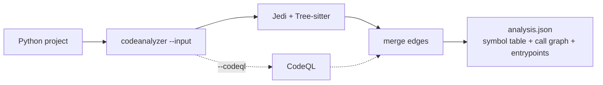

import { Card, CardGrid, LinkCard, Tabs, TabItem } from "@astrojs/starlight/components";

```bash frame="none"
pip install codeanalyzer-python
```

Point `codeanalyzer` at a project and it emits a single **`analysis.json`** — a typed model of every module, class, method, and call edge, plus the framework entrypoints that reach them. One artifact, schema-stable, ready to load into a graph or hand to a code LLM. It's the Python backend behind [CLDK](https://github.com/codellm-devkit/python-sdk), usable standalone as a CLI or a library.

```bash frame="none"
codeanalyzer --input ./my-python-project --output ./out
# -> ./out/analysis.json   (symbol table + call graph + entrypoints)
```

## What codeanalyzer-python gives you

<ul class="cldk-capabilities">
  <a class="cldk-capability" href="/codeanalyzer-python/guides/concepts/#symbol-table">
    <p class="cldk-capability__title">Symbol table</p>
    <p class="cldk-capability__def">Every module, class, method, and field — typed, located, and queryable.</p>
    <pre class="cldk-capability__thumb">analysis.symbol_table
PyModule -> PyClass -> PyCallable</pre>
    <ul class="cldk-capability__examples"><li>Enumerate classes and methods</li><li>Pull a callable's source body</li></ul>
  </a>
  <a class="cldk-capability" href="/codeanalyzer-python/guides/concepts/#call-graph">
    <p class="cldk-capability__title">Call graph</p>
    <p class="cldk-capability__def">Who-calls-whom as identity-keyed edges with provenance.</p>
    <pre class="cldk-capability__thumb">analysis.call_graph
PyCallEdge(source -> target)</pre>
    <ul class="cldk-capability__examples"><li>Find every caller of a method</li><li>Load into <code>networkx</code> and walk it</li></ul>
  </a>
  <a class="cldk-capability" href="/codeanalyzer-python/guides/entrypoints/">
    <p class="cldk-capability__title">Entrypoints</p>
    <p class="cldk-capability__def">Framework-dispatched roots — Flask routes, Celery tasks, CLI commands.</p>
    <pre class="cldk-capability__thumb">analysis.entrypoints
PyEntrypoint(framework, route)</pre>
    <ul class="cldk-capability__examples"><li>List every HTTP route</li><li>Seed reachability from real roots</li></ul>
  </a>
  <a class="cldk-capability" href="/codeanalyzer-python/guides/codeql/">
    <p class="cldk-capability__title">CodeQL resolution</p>
    <p class="cldk-capability__def">Optional second engine that recovers edges Jedi can't see.</p>
    <pre class="cldk-capability__thumb">codeanalyzer -i ./proj --codeql</pre>
    <ul class="cldk-capability__examples"><li>Resolve dynamic-dispatch targets</li><li>Backfill unresolved call sites</li></ul>
  </a>
  <a class="cldk-capability" href="/codeanalyzer-python/extending/analysis-passes/">
    <p class="cldk-capability__title">Extensible passes</p>
    <p class="cldk-capability__def">Add your own entrypoint finders and synthetic edges via entry points.</p>
    <pre class="cldk-capability__thumb">[project.entry-points.
"codeanalyzer.analysis_passes"]</pre>
    <ul class="cldk-capability__examples"><li>Detect a new framework</li><li>Synthesize ORM-dispatch edges</li></ul>
  </a>
</ul>

<div class="cldk-agent-band">

## One artifact, three engines

Jedi resolves the symbol table and a lexical call graph on every run — no setup beyond a Python interpreter. Tree-sitter backs the syntactic extraction. CodeQL is opt-in: when you pass `--codeql`, codeanalyzer downloads the CLI on first use, builds a database, and merges its resolved edges with Jedi's — recovering RPC, third-party, and dynamically-dispatched targets that lexical analysis misses. Every edge records its `provenance`, so you always know which engine saw it.

```bash
# Jedi only (default) — fast, zero external tooling
codeanalyzer --input ./proj

# Add CodeQL — deeper resolution, downloaded and cached per project
codeanalyzer --input ./proj --codeql
```



[See how the call graph is built →](/codeanalyzer-python/guides/concepts/#call-graph)

</div>

## Start building

<CardGrid>
  <LinkCard title="Quickstart" description="Install the CLI and produce your first analysis.json in a couple of minutes." href="/codeanalyzer-python/quickstart/" />
  <LinkCard title="What is codeanalyzer-python?" description="The mental model: project in → one typed PyApplication artifact out." href="/codeanalyzer-python/what-is-codeanalyzer/" />
  <LinkCard title="CLI usage" description="Every flag, with worked examples: output formats, caching, single-file mode." href="/codeanalyzer-python/guides/cli-usage/" />
  <LinkCard title="Entrypoint detection" description="JackEE-style finders that surface Flask, FastAPI, Celery, Click, and gRPC roots." href="/codeanalyzer-python/guides/entrypoints/" />
</CardGrid>

## Learn more

<CardGrid>
  <LinkCard title="Core concepts" description="Symbol table, call graph, entrypoints, provenance, and the analysis cache." href="/codeanalyzer-python/guides/concepts/" />
  <LinkCard title="Output schema" description="The PyApplication data model, field by field." href="/codeanalyzer-python/reference/schema/" />
  <LinkCard title="CodeQL analysis" description="What --codeql adds, how the database is cached, and the resolution ladder." href="/codeanalyzer-python/guides/codeql/" />
  <LinkCard title="Analysis passes" description="Write your own pass: detect a framework or synthesize edges the static graph can't see." href="/codeanalyzer-python/extending/analysis-passes/" />
</CardGrid>

<p class="cldk-badges">
  <a href="https://pypi.org/project/codeanalyzer-python/"></a>
  <a href="https://opensource.org/licenses/Apache-2.0"></a>
  <a href="https://discord.gg/zEjz9YrmqN"></a>
</p>
