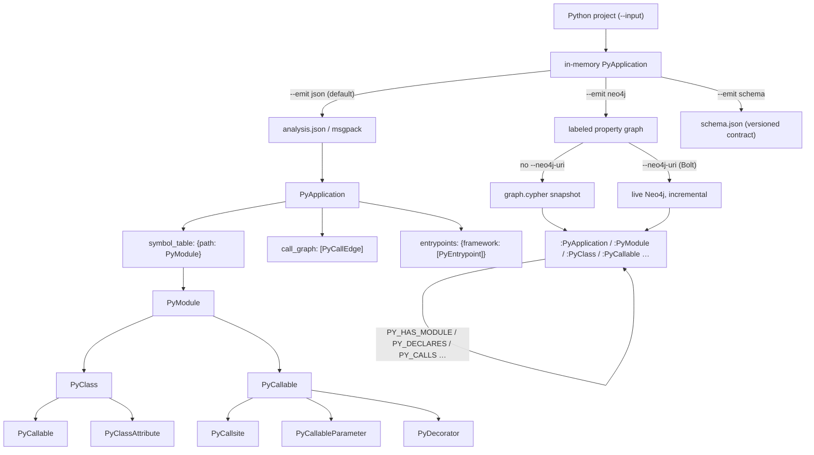
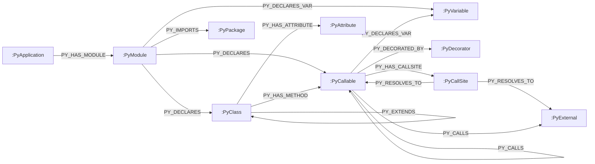

import { Aside, LinkCard, CardGrid } from "@astrojs/starlight/components";

`canpy` builds one analysis in memory and can serialize it two ways. The default is a single `PyApplication` artifact — `analysis.json` (or msgpack). With `--emit neo4j` the *same* in-memory `PyApplication` is projected into a labeled property graph instead of a file. This page is the schema reference for both: the [JSON model](#the-json-model-pyapplication) and the [Neo4j property graph](#the-neo4j-property-graph).



## The JSON model (`PyApplication`)

The default artifact is a single `PyApplication`. Every model below is a Pydantic model defined in `codeanalyzer.schema.py_schema`; the JSON and msgpack outputs are serializations of the same schema. Line/column fields default to `-1` when unknown.

### PyApplication

The root object.

| Field | Type | Description |
| --- | --- | --- |
| `symbol_table` | `Dict[str, PyModule]` | File path → module model. The whole-project inventory. |
| `call_graph` | `List[PyCallEdge]` | Identity-keyed call edges. |
| `entrypoints` | `Dict[str, List[PyEntrypoint]]` | Framework name → detected roots. |

### PyModule

One per source file.

| Field | Type | Description |
| --- | --- | --- |
| `file_path` | `str` | Absolute path to the file. |
| `module_name` | `str` | Dotted module name. |
| `imports` | `List[PyImport]` | Import statements. |
| `comments` | `List[PyComment]` | Comments and docstrings. |
| `classes` | `Dict[str, PyClass]` | Top-level classes by name. |
| `functions` | `Dict[str, PyCallable]` | Top-level functions by name. |
| `variables` | `List[PyVariableDeclaration]` | Module-level variables. |
| `content_hash`, `last_modified`, `file_size` | `str` / `float` / `int` | Cache-invalidation metadata. |

### PyClass

| Field | Type | Description |
| --- | --- | --- |
| `name` | `str` | Class short name. |
| `signature` | `str` | Fully-qualified identity (e.g. `module.ClassName`). |
| `base_classes` | `List[str]` | Names of base classes. |
| `decorators` | `List[PyDecorator]` | Class decorators. |
| `methods` | `Dict[str, PyCallable]` | Methods by name. |
| `attributes` | `Dict[str, PyClassAttribute]` | Class attributes by name. |
| `inner_classes` | `Dict[str, PyClass]` | Nested classes. |
| `comments`, `code` | `List[PyComment]` / `str` | Docstrings/comments and source. |
| `start_line`, `end_line` | `int` | Source span. |

### PyCallable

A function or method. The richest model in the artifact.

| Field | Type | Description |
| --- | --- | --- |
| `name` | `str` | Callable short name. |
| `path` | `str` | File the callable is defined in. |
| `signature` | `str` | Fully-qualified identity (e.g. `module.Class.method`). The call-graph node key. |
| `parameters` | `List[PyCallableParameter]` | Declared parameters. |
| `return_type` | `Optional[str]` | Resolved return type, if known. |
| `decorators` | `List[PyDecorator]` | Applied decorators. |
| `code` | `Optional[str]` | The source body. |
| `call_sites` | `List[PyCallsite]` | Calls made *from* this callable. |
| `accessed_symbols` | `List[PySymbol]` | Symbols read/written in the body. |
| `local_variables` | `List[PyVariableDeclaration]` | Locals. |
| `inner_callables`, `inner_classes` | `Dict[str, ...]` | Nested definitions. |
| `cyclomatic_complexity` | `int` | Computed complexity. |
| `is_entrypoint` | `bool` | Whether a finder marked this an entrypoint. |
| `entrypoint_framework` | `Optional[str]` | The framework, if so. |
| `start_line`, `end_line`, `code_start_line` | `int` | Source spans. |

### PyCallsite

A single call made from within a callable — the rich per-call metadata behind a graph edge.

| Field | Type | Description |
| --- | --- | --- |
| `method_name` | `str` | The invoked name as written. |
| `receiver_expr`, `receiver_type` | `Optional[str]` | The receiver expression and its resolved type. |
| `argument_types` | `List[str]` | Resolved argument types. |
| `return_type` | `Optional[str]` | Resolved return type. |
| `callee_signature` | `Optional[str]` | The resolved target's signature (CodeQL may backfill this). |
| `is_constructor_call` | `bool` | Whether the call constructs an instance. |
| `start_line`, `end_line`, … | `int` | Source location. |

### PyCallEdge

An identity-only call-graph edge.

| Field | Type | Description |
| --- | --- | --- |
| `source` | `str` | Caller's `PyCallable.signature`. |
| `target` | `str` | Callee's `PyCallable.signature`. |
| `type` | `"CALL_DEP"` | Edge kind. |
| `weight` | `int` | Edge weight (default `1`). |
| `provenance` | `List[str]` | Which engine(s) produced it: `"jedi"`, `"codeql"`, or an extension token. Open vocabulary. |
| `tags` | `Dict[str, str]` | Free-form, extension-namespaced metadata (e.g. an ORM-dispatch trigger predicate). Never interpreted by core. |

<Aside type="note">
Edge endpoints not present in the symbol table (third-party / RPC targets) are kept as *ghost nodes* rather than dropped. See [Core concepts](/codeanalyzer-python/guides/concepts/#call-graph).
</Aside>

### PyEntrypoint

A framework-dispatched root, referencing a callable by signature.

| Field | Type | Description |
| --- | --- | --- |
| `signature` | `str` | The `PyCallable.signature` this entrypoint refers to. |
| `framework` | `str` | The dispatching framework. |
| `detection_source` | `str` | How it was detected — `decorator`, `base_class`, `url_resolver`, `router_mount`, `blueprint`, `lambda_template`, `typer_subapp`, `click_add_command`, `argparse_dispatch`, `convention`, or `extension`. Open vocabulary. |
| `route_path`, `http_methods` | `Optional[str]` / `List[str]` | For HTTP routes. |
| `celery_task_name`, `cli_command_name`, `lambda_handler_key`, `grpc_service_name` | `Optional[str]` | Framework-specific identifiers, when applicable. |
| `source_file` | `Optional[str]` | File declaring the binding (`urls.py`, `template.yaml`, …). |
| `tags` | `Dict[str, str]` | Free-form, namespaced metadata for extensions. |

### Supporting models

- **`PyImport`** — `module`, `name`, `alias`, and source span.
- **`PyComment`** — `content`, `is_docstring`, and source span.
- **`PyDecorator`** — `name`, resolved `qualified_name`, and raw `positional_arguments` / `keyword_arguments` (source-text fragments for finders to parse).
- **`PyCallableParameter`** — `name`, `type`, `default_value`, source span.
- **`PyClassAttribute`** — `name`, `type`, comments, source span.
- **`PyVariableDeclaration`** — `name`, `type`, `initializer`, `value`, `scope`.
- **`PySymbol`** — a referenced symbol: `name`, `scope`, `kind`, resolved `type`, `qualified_name`, `is_builtin`.

### Serialization helpers

Every model is decorated for MessagePack support, exposing `to_msgpack_bytes()` / `from_msgpack_bytes()` (gzip-compressed) and `to_msgpack_dict()` / `from_msgpack_dict()`. `PyApplication` additionally exposes `get_compression_ratio()`. For JSON, use the Pydantic v1/v2 compatibility helpers `model_dump_json` / `model_validate_json` from `codeanalyzer.schema`. Models built via the fluent builder pattern — `PyApplication.builder().symbol_table(...).call_graph(...).build()`.

## The Neo4j property graph

`--emit neo4j` projects the same in-memory `PyApplication` into a labeled property graph instead of a JSON file. Where `analysis.json` is one self-contained blob you load whole into memory, the graph is a persistent, queryable system of record: many applications can live in one database — each anchored at its own `:PyApplication` node — so whole-monorepo or cross-service questions become a Cypher traversal rather than parsing giant JSON files. See the [CLI reference](/codeanalyzer-python/reference/cli/#neo4j-property-graph----emit-neo4j) for how the two writers (the `graph.cypher` snapshot and the incremental Bolt push) work.

Every node label is `Py`-prefixed and every relationship type is `PY_`-prefixed (e.g. `:PyClass`, `PY_CALLS`), so the Java, TypeScript, and Python analyzers can share one database without label or relationship-type collisions. Declarations — classes, callables, and external symbols — are keyed by their `signature` and merged under a shared `:PySymbol` label, which is what makes the identity invariant cheap to enforce and cross-module references stable. The labels, relationships, and properties below are generated from `codeanalyzer/neo4j/catalog.py` and published verbatim as the [machine-readable schema contract](#the-schema-contract).

### Node labels

The `key` is the property the node is `MERGE`d on. Declaration nodes (`:PyClass`, `:PyCallable`, `:PyExternal`) carry the extra `:PySymbol` label and are merged on `signature`.

| Label | Merge label | Key | Notable properties |
| --- | --- | --- | --- |
| `:PyApplication` | `:PyApplication` | `name` | `schema_version` — the application anchor, named by `--app-name`. |
| `:PyModule` | `:PyModule` | `file_key` | `module_name`, `content_hash`, `last_modified`, `file_size`. |
| `:PyClass` | `:PySymbol` | `signature` | `name`, `code`, `base_classes`, `docstring`, `start_line`, `end_line`. |
| `:PyCallable` | `:PySymbol` | `signature` | `name`, `path`, `return_type`, `cyclomatic_complexity`, `code`, `code_start_line`, `start_line`. |
| `:PyExternal` | `:PySymbol` | `signature` | `name`, `module` — a *ghost node* for a third-party / unresolved target, mirroring the JSON call graph's ghost-node behavior. |
| `:PyPackage` | `:PyPackage` | `name` | An imported package, shared across modules and applications. |
| `:PyDecorator` | `:PyDecorator` | `name` | A decorator, shared across callables and applications. |
| `:PyCallSite` | `:PyCallSite` | `id` | `method_name`, `receiver_expr`, `receiver_type`, `argument_types`, `return_type`, `callee_signature`, `is_constructor_call`. |
| `:PyAttribute` | `:PyAttribute` | `id` | `name`, `type`, `docstring`, `start_line`, `end_line`. |
| `:PyVariable` | `:PyVariable` | `id` | `name`, `type`, `initializer`, `scope`, `start_line`, `end_line`. |

<Aside type="note">
`:PyExternal`, `:PyPackage`, and `:PyDecorator` are shared, application-independent nodes — they are `MERGE`-only and never blindly deleted, so they accumulate across the applications loaded into one database rather than being clobbered per push.
</Aside>

### Relationship types

| Relationship | Endpoints | Notes |
| --- | --- | --- |
| `PY_HAS_MODULE` | `(:PyApplication)-[]->(:PyModule)` | The application anchor contains each analyzed source module. |
| `PY_DECLARES` | `(:PyModule｜PyClass｜PyCallable)-[]->(:PyClass｜PyCallable)` | Declaration containment, recursive: modules declare top-level classes/functions; classes and callables declare nested ones. |
| `PY_HAS_METHOD` | `(:PyClass)-[]->(:PyCallable)` | A class owns a method callable. |
| `PY_HAS_ATTRIBUTE` | `(:PyClass)-[]->(:PyAttribute)` | A class owns an attribute. |
| `PY_DECLARES_VAR` | `(:PyModule｜PyCallable)-[]->(:PyVariable)` | A module- or function-scoped variable declaration. |
| `PY_HAS_CALLSITE` | `(:PyCallable)-[]->(:PyCallSite)` | A callable contains the call sites it makes. |
| `PY_RESOLVES_TO` | `(:PyCallSite)-[]->(:PyCallable｜PyExternal)` | A call site resolves to a concrete callable or an external (ghost) symbol. |
| `PY_CALLS` | `(:PyCallable｜PyExternal)-[]->(:PyCallable｜PyExternal)` | The call-graph edge. Properties: `weight` (integer), `provenance` (`string[]`, e.g. `jedi` / `codeql` / an extension token). |
| `PY_EXTENDS` | `(:PyClass)-[]->(:PyClass)` | Class inheritance (self-referential). |
| `PY_IMPORTS` | `(:PyModule)-[]->(:PyPackage)` | A module imports a package. Properties: `imported_names` (`string[]`), `aliases` (`string[]`). |
| `PY_DECORATED_BY` | `(:PyCallable)-[]->(:PyDecorator)` | A callable is decorated by a decorator. |

The `PY_CALLS` edge is the property-graph form of [`PyCallEdge`](#pycalledge): the same `weight` and `provenance` carry over, and the same optional [CodeQL augmentation](/codeanalyzer-python/guides/codeql/) backfills resolved call edges. `PY_RESOLVES_TO` preserves the finer per-call-site resolution that `PyCallsite` records in the JSON model.



### Constraints and indexes

Both writers run the same DDL before any load (it is idempotent — every statement is `IF NOT EXISTS`) so each `MERGE` is an index seek rather than a label scan, and the identity invariant is enforced by the database itself.

```cypher
// Uniqueness constraints
CREATE CONSTRAINT py_symbol_sig    IF NOT EXISTS FOR (s:PySymbol)     REQUIRE s.signature IS UNIQUE;
CREATE CONSTRAINT py_app_name      IF NOT EXISTS FOR (a:PyApplication) REQUIRE a.name      IS UNIQUE;
CREATE CONSTRAINT py_module_key    IF NOT EXISTS FOR (m:PyModule)     REQUIRE m.file_key  IS UNIQUE;
CREATE CONSTRAINT py_package_name  IF NOT EXISTS FOR (p:PyPackage)    REQUIRE p.name      IS UNIQUE;
CREATE CONSTRAINT py_decorator_name IF NOT EXISTS FOR (d:PyDecorator) REQUIRE d.name      IS UNIQUE;
CREATE CONSTRAINT py_callsite_id   IF NOT EXISTS FOR (c:PyCallSite)   REQUIRE c.id        IS UNIQUE;
CREATE CONSTRAINT py_attribute_id  IF NOT EXISTS FOR (a:PyAttribute)  REQUIRE a.id        IS UNIQUE;
CREATE CONSTRAINT py_variable_id   IF NOT EXISTS FOR (v:PyVariable)   REQUIRE v.id        IS UNIQUE;

// Lookup indexes
CREATE INDEX py_callable_name IF NOT EXISTS FOR (c:PyCallable) ON (c.name);
CREATE INDEX py_class_name    IF NOT EXISTS FOR (c:PyClass)    ON (c.name);

// Fulltext index for code search over callable bodies and docstrings
CREATE FULLTEXT INDEX py_code_fts IF NOT EXISTS FOR (c:PyCallable) ON EACH [c.code, c.docstring];
```

The `py_code_fts` fulltext index backs code search across everything loaded into the database — query it with `db.index.fulltext.queryNodes`, then filter to one application by walking back to its anchor:

```cypher
CALL db.index.fulltext.queryNodes('py_code_fts', 'subprocess AND shell')
YIELD node, score
MATCH (app:PyApplication {name: 'my-service'})
      -[:PY_HAS_MODULE]->(:PyModule)-[:PY_DECLARES*1..]->(node)
RETURN node.signature AS callable, score
ORDER BY score DESC
LIMIT 20;
```

Because every subgraph hangs off its `:PyApplication` anchor, every query scopes to one application by matching `{name: '<app-name>'}` — the same value passed as `--app-name` at emit time. That scoping is also what keeps a shared database multi-tenant: a push for one application only touches its own anchored subtree.

### The schema contract

`--emit schema` serializes this catalog — node labels, relationship types, and their property types — to a version-stamped `schema.json`. It is a static catalog, so no project is required:

```bash
# Print the contract to stdout (no project needed)
canpy --emit schema

# Or write it to a directory
canpy --emit schema --output ./out   # → ./out/schema.json
```

The contract carries `SCHEMA_VERSION` (currently `1.1.0`), the same value stamped onto every graph's `:PyApplication` node. It is checked in as `schema.neo4j.json` and shipped as a GitHub Release asset, so consumers can pin to a version and detect contract changes:

```json
{
  "schema_version": "1.1.0",
  "generator": "codeanalyzer-python",
  "node_labels": [
    {
      "label": "PyApplication",
      "merge_label": "PyApplication",
      "key": "name",
      "properties": { "name": "string", "schema_version": "string" }
    }
  ]
}
```

## Reading the graph back with CLDK

The [CLDK Python SDK](https://github.com/codellm-devkit/python-sdk) has a read-only Neo4j backend that reconstructs these same typed models from the graph — no JDK, no native binary, and no project source on the consumer, only read-only Neo4j credentials. Pass a `Neo4jConnectionConfig` whose `application_name` matches the `--app-name` the graph was loaded with, and `CLDK.python` rebuilds the same `PyClass` / `PyCallable` objects and the same `networkx` call graph the in-process analyzer would produce:

```python
from cldk import CLDK
from cldk.analysis.commons.backend_config import Neo4jConnectionConfig

# The graph is populated out of band by `canpy --emit neo4j`; the SDK only reads it.
analysis = CLDK.python(
    backend=Neo4jConnectionConfig(
        uri="bolt://localhost:7687",
        username="neo4j",
        password="neo4j",
        application_name="my-service",  # matches canpy --app-name
    ),
)

classes = analysis.get_classes()    # Dict[str, PyClass]
cg = analysis.get_call_graph()      # networkx.DiGraph keyed by callable signatures
```

The SDK's `neo4j` driver is an optional extra (`pip install cldk[neo4j]`). See the [Neo4j guide](/codeanalyzer-python/guides/neo4j/) for the full read API, and the [CLI reference](/codeanalyzer-python/reference/cli/#reading-the-graph-back-with-cldk) for how producers and consumers split.

## Where to go next

<CardGrid>
  <LinkCard title="Core concepts" description="How these models relate at runtime." href="/codeanalyzer-python/guides/concepts/" />
  <LinkCard title="Neo4j guide" description="Emit, push, and query the property graph end to end." href="/codeanalyzer-python/guides/neo4j/" />
  <LinkCard title="Analysis passes" description="How extensions emit PyEntrypoint and PyCallEdge with tags." href="/codeanalyzer-python/extending/analysis-passes/" />
  <LinkCard title="CLI options" description="The flags that control what ends up in the artifact." href="/codeanalyzer-python/reference/cli/" />
</CardGrid>
