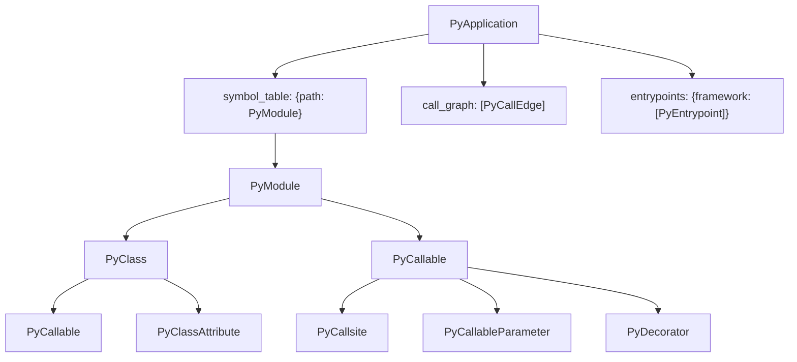

import { Aside, LinkCard, CardGrid } from "@astrojs/starlight/components";

The artifact codeanalyzer-python emits is a single `PyApplication`. Every model below is a Pydantic model defined in `codeanalyzer.schema.py_schema`; the JSON and msgpack outputs are serializations of the same schema. Line/column fields default to `-1` when unknown.

## PyApplication

The root object.

| Field | Type | Description |
| --- | --- | --- |
| `symbol_table` | `Dict[str, PyModule]` | File path → module model. The whole-project inventory. |
| `call_graph` | `List[PyCallEdge]` | Identity-keyed call edges. |
| `entrypoints` | `Dict[str, List[PyEntrypoint]]` | Framework name → detected roots. |

## PyModule

One per source file.

| Field | Type | Description |
| --- | --- | --- |
| `file_path` | `str` | Absolute path to the file. |
| `module_name` | `str` | Dotted module name. |
| `imports` | `List[PyImport]` | Import statements. |
| `comments` | `List[PyComment]` | Comments and docstrings. |
| `classes` | `Dict[str, PyClass]` | Top-level classes by name. |
| `functions` | `Dict[str, PyCallable]` | Top-level functions by name. |
| `variables` | `List[PyVariableDeclaration]` | Module-level variables. |
| `content_hash`, `last_modified`, `file_size` | `str` / `float` / `int` | Cache-invalidation metadata. |

## PyClass

| Field | Type | Description |
| --- | --- | --- |
| `name` | `str` | Class short name. |
| `signature` | `str` | Fully-qualified identity (e.g. `module.ClassName`). |
| `base_classes` | `List[str]` | Names of base classes. |
| `decorators` | `List[PyDecorator]` | Class decorators. |
| `methods` | `Dict[str, PyCallable]` | Methods by name. |
| `attributes` | `Dict[str, PyClassAttribute]` | Class attributes by name. |
| `inner_classes` | `Dict[str, PyClass]` | Nested classes. |
| `comments`, `code` | `List[PyComment]` / `str` | Docstrings/comments and source. |
| `start_line`, `end_line` | `int` | Source span. |

## PyCallable

A function or method. The richest model in the artifact.

| Field | Type | Description |
| --- | --- | --- |
| `name` | `str` | Callable short name. |
| `path` | `str` | File the callable is defined in. |
| `signature` | `str` | Fully-qualified identity (e.g. `module.Class.method`). The call-graph node key. |
| `parameters` | `List[PyCallableParameter]` | Declared parameters. |
| `return_type` | `Optional[str]` | Resolved return type, if known. |
| `decorators` | `List[PyDecorator]` | Applied decorators. |
| `code` | `Optional[str]` | The source body. |
| `call_sites` | `List[PyCallsite]` | Calls made *from* this callable. |
| `accessed_symbols` | `List[PySymbol]` | Symbols read/written in the body. |
| `local_variables` | `List[PyVariableDeclaration]` | Locals. |
| `inner_callables`, `inner_classes` | `Dict[str, ...]` | Nested definitions. |
| `cyclomatic_complexity` | `int` | Computed complexity. |
| `is_entrypoint` | `bool` | Whether a finder marked this an entrypoint. |
| `entrypoint_framework` | `Optional[str]` | The framework, if so. |
| `start_line`, `end_line`, `code_start_line` | `int` | Source spans. |

## PyCallsite

A single call made from within a callable — the rich per-call metadata behind a graph edge.

| Field | Type | Description |
| --- | --- | --- |
| `method_name` | `str` | The invoked name as written. |
| `receiver_expr`, `receiver_type` | `Optional[str]` | The receiver expression and its resolved type. |
| `argument_types` | `List[str]` | Resolved argument types. |
| `return_type` | `Optional[str]` | Resolved return type. |
| `callee_signature` | `Optional[str]` | The resolved target's signature (CodeQL may backfill this). |
| `is_constructor_call` | `bool` | Whether the call constructs an instance. |
| `start_line`, `end_line`, … | `int` | Source location. |

## PyCallEdge

An identity-only call-graph edge.

| Field | Type | Description |
| --- | --- | --- |
| `source` | `str` | Caller's `PyCallable.signature`. |
| `target` | `str` | Callee's `PyCallable.signature`. |
| `type` | `"CALL_DEP"` | Edge kind. |
| `weight` | `int` | Edge weight (default `1`). |
| `provenance` | `List[str]` | Which engine(s) produced it: `"jedi"`, `"codeql"`, or an extension token. Open vocabulary. |
| `tags` | `Dict[str, str]` | Free-form, extension-namespaced metadata (e.g. an ORM-dispatch trigger predicate). Never interpreted by core. |

<Aside type="note">
Edge endpoints not present in the symbol table (third-party / RPC targets) are kept as *ghost nodes* rather than dropped. See [Core concepts](/codeanalyzer-python/guides/concepts/#call-graph).
</Aside>

## PyEntrypoint

A framework-dispatched root, referencing a callable by signature.

| Field | Type | Description |
| --- | --- | --- |
| `signature` | `str` | The `PyCallable.signature` this entrypoint refers to. |
| `framework` | `str` | The dispatching framework. |
| `detection_source` | `str` | How it was detected — `decorator`, `base_class`, `url_resolver`, `router_mount`, `blueprint`, `lambda_template`, `typer_subapp`, `click_add_command`, `argparse_dispatch`, `convention`, or `extension`. Open vocabulary. |
| `route_path`, `http_methods` | `Optional[str]` / `List[str]` | For HTTP routes. |
| `celery_task_name`, `cli_command_name`, `lambda_handler_key`, `grpc_service_name` | `Optional[str]` | Framework-specific identifiers, when applicable. |
| `source_file` | `Optional[str]` | File declaring the binding (`urls.py`, `template.yaml`, …). |
| `tags` | `Dict[str, str]` | Free-form, namespaced metadata for extensions. |

## Supporting models

- **`PyImport`** — `module`, `name`, `alias`, and source span.
- **`PyComment`** — `content`, `is_docstring`, and source span.
- **`PyDecorator`** — `name`, resolved `qualified_name`, and raw `positional_arguments` / `keyword_arguments` (source-text fragments for finders to parse).
- **`PyCallableParameter`** — `name`, `type`, `default_value`, source span.
- **`PyClassAttribute`** — `name`, `type`, comments, source span.
- **`PyVariableDeclaration`** — `name`, `type`, `initializer`, `value`, `scope`.
- **`PySymbol`** — a referenced symbol: `name`, `scope`, `kind`, resolved `type`, `qualified_name`, `is_builtin`.

## Serialization helpers

Every model is decorated for MessagePack support, exposing `to_msgpack_bytes()` / `from_msgpack_bytes()` (gzip-compressed) and `to_msgpack_dict()` / `from_msgpack_dict()`. `PyApplication` additionally exposes `get_compression_ratio()`. For JSON, use the Pydantic v1/v2 compatibility helpers `model_dump_json` / `model_validate_json` from `codeanalyzer.schema`. Models built via the fluent builder pattern — `PyApplication.builder().symbol_table(...).call_graph(...).build()`.

## Where to go next

<CardGrid>
  <LinkCard title="Core concepts" description="How these models relate at runtime." href="/codeanalyzer-python/guides/concepts/" />
  <LinkCard title="Analysis passes" description="How extensions emit PyEntrypoint and PyCallEdge with tags." href="/codeanalyzer-python/extending/analysis-passes/" />
  <LinkCard title="CLI options" description="The flags that control what ends up in the artifact." href="/codeanalyzer-python/reference/cli/" />
</CardGrid>
