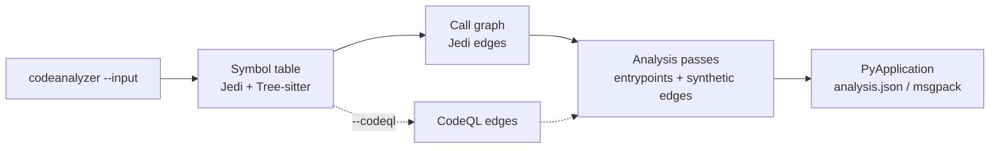

import { Steps, Aside, LinkCard, CardGrid, Tabs, TabItem } from "@astrojs/starlight/components";

**codeanalyzer-python** is a static-analysis tool for Python source code. You point it at a project directory and it produces one typed artifact — a `PyApplication` — that captures the project's **symbol table** (modules, classes, callables, fields), its **call graph** (who-calls-whom), and its **framework entrypoints** (the routes, tasks, and commands a framework dispatches into). You stop grepping source by hand and start querying a structured model of the program.

It is the Python backend behind [CLDK](https://github.com/codellm-devkit/python-sdk), the multilingual analysis SDK — the same role [`codeanalyzer`](https://github.com/codellm-devkit/codeanalyzer-java) plays for Java. You can use it through CLDK's typed facade, or directly: as a CLI that writes `analysis.json`, or as a Python library that hands you `PyApplication` objects.

## The mental model

Every run follows the same shape: point at a project, build the artifact, consume the typed model.

<Steps>

1. **Point at a project.** `codeanalyzer --input ./my-project`. The tool discovers every `.py` file (test files excluded by default), and creates an isolated virtual environment so dependencies resolve.

2. **It builds a `PyApplication`.** Jedi and Tree-sitter extract the symbol table; a call graph is derived from it; optional CodeQL resolution and a pluggable pass pipeline enrich it with extra edges and entrypoints.

3. **Consume the typed model.** Get `analysis.json` (or msgpack) on disk, or the in-memory `PyApplication`. Everything is a Pydantic model: `symbol_table`, `call_graph`, `entrypoints`.

</Steps>



## What you get back

The artifact is a single `PyApplication` with three top-level pieces:

| Field | Type | What it holds |
| --- | --- | --- |
| `symbol_table` | `Dict[str, PyModule]` | One `PyModule` per source file — its imports, classes, functions, and module-level variables. |
| `call_graph` | `List[PyCallEdge]` | Identity-keyed `source -> target` edges (by `PyCallable.signature`) with a `weight` and `provenance`. |
| `entrypoints` | `Dict[str, List[PyEntrypoint]]` | Framework-dispatched roots, keyed by framework name. |

<Aside type="note" title="Identity-keyed graph">
Call-graph nodes aren't a separate vertex type — they're the `PyCallable.signature` strings already in the symbol table. Rich per-call metadata (receiver, arguments, location) lives on the `PyCallsite` entries inside each callable. See the [output schema](/codeanalyzer-python/reference/schema/).
</Aside>

## Two ways to use it

<Tabs>
  <TabItem label="CLI">
```bash
# Write analysis.json to ./out
codeanalyzer --input ./my-project --output ./out

# Or stream JSON to stdout (no --output)
codeanalyzer --input ./my-project | jq '.entrypoints'
```
  </TabItem>
  <TabItem label="Library">
```python
from pathlib import Path
from codeanalyzer.core import Codeanalyzer
from codeanalyzer.options import AnalysisOptions

options = AnalysisOptions(input=Path("./my-project"))
with Codeanalyzer(options) as analyzer:
    app = analyzer.analyze()          # -> PyApplication

print(len(app.symbol_table), "modules")
print(len(app.call_graph), "edges")
```
  </TabItem>
  <TabItem label="Through CLDK">
```python
from cldk import CLDK
from cldk.analysis import AnalysisLevel

analysis = CLDK(language="python").analysis(
    project_path="my-project",
    analysis_level=AnalysisLevel.call_graph,
)
print(analysis.get_call_graph())      # -> networkx.DiGraph
```
  </TabItem>
</Tabs>

## Why a dedicated tool

A code LLM asked *"what calls this function?"* without analysis crawls: file read after file read, grep after grep, burning tokens on an answer it still can't be sure of. codeanalyzer-python resolves that once, statically, into a graph — so the answer is a lookup, not a guess. Jedi gives you that for free on every run; CodeQL deepens it when dynamic dispatch and third-party calls matter; the pass pipeline surfaces the framework roots that make reachability questions meaningful.

## Where to go next

<CardGrid>
  <LinkCard title="Quickstart" description="Install and produce your first analysis.json." href="/codeanalyzer-python/quickstart/" />
  <LinkCard title="Core concepts" description="Symbol table, call graph, entrypoints, provenance, caching." href="/codeanalyzer-python/guides/concepts/" />
  <LinkCard title="CLI usage" description="Every flag with worked examples." href="/codeanalyzer-python/guides/cli-usage/" />
  <LinkCard title="Output schema" description="The PyApplication data model in full." href="/codeanalyzer-python/reference/schema/" />
</CardGrid>
