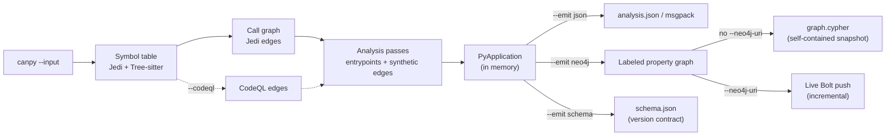

import Neo4jPropertyGraph from '../../components/Neo4jPropertyGraph.astro';
import { Steps, Aside, LinkCard, CardGrid, Tabs, TabItem } from "@astrojs/starlight/components";

**codeanalyzer-python** is a static-analysis tool for Python source code. You point it at a project directory and it produces one typed artifact — a `PyApplication` — that captures the project's **symbol table** (modules, classes, callables, fields), its **call graph** (who-calls-whom), and its **framework entrypoints** (the routes, tasks, and commands a framework dispatches into). You stop grepping source by hand and start querying a structured model of the program.

It builds one analysis in memory and can emit it three ways: as the default `analysis.json`, as a **Neo4j property graph** (a queryable, persistent system of record), or as the version-stamped schema contract that describes that graph. The graph is the same `PyApplication` projected onto labeled nodes and typed relationships — so a whole portfolio of applications can live in one database and be traversed with Cypher instead of parsed out of giant JSON blobs.

<Neo4jPropertyGraph />

It is the Python backend behind [CLDK](https://github.com/codellm-devkit/python-sdk), the multilingual analysis SDK — the same role [`canjava`](https://github.com/codellm-devkit/codeanalyzer-java) plays for Java. You can use it through CLDK's typed facade, or directly: as a CLI that writes `analysis.json` or a property graph, or as a Python library that hands you `PyApplication` objects.

<Aside type="note" title="The CLI is now canpy">
The command was renamed from `codeanalyzer` to `canpy` (matching the `cants` TypeScript sibling). The old `codeanalyzer` command still works as a deprecated alias and prints a notice to stderr. Every example below uses `canpy`.
</Aside>

## The mental model

Every run follows the same shape: point at a project, build the artifact, choose an output target.

<Steps>

1. **Point at a project.** `canpy --input ./my-project`. The tool discovers every `.py` file (test files excluded by default), and creates an isolated virtual environment so dependencies resolve.

2. **It builds a `PyApplication`.** Jedi and Tree-sitter extract the symbol table; a call graph is derived from it; optional CodeQL resolution and a pluggable pass pipeline enrich it with extra edges and entrypoints.

3. **Emit it.** One analysis, three targets via `--emit`: `json` (the default `analysis.json` / msgpack), `neo4j` (a `graph.cypher` snapshot or a live incremental Bolt push), or `schema` (the machine-readable, version-stamped graph schema). The same typed model underlies all three.

</Steps>



## What you get back

The artifact is a single `PyApplication` with three top-level pieces:

| Field | Type | What it holds |
| --- | --- | --- |
| `symbol_table` | `Dict[str, PyModule]` | One `PyModule` per source file — its imports, classes, functions, and module-level variables. |
| `call_graph` | `List[PyCallEdge]` | Identity-keyed `source -> target` edges (by `PyCallable.signature`) with a `weight` and `provenance`. |
| `entrypoints` | `Dict[str, List[PyEntrypoint]]` | Framework-dispatched roots, keyed by framework name. |
| `external_symbols` | `Dict[str, ...]` | First-class library/built-in targets (`signature -> {name, module}`) the call graph reaches but doesn't own. |

<Aside type="note" title="Identity-keyed graph">
Call-graph nodes aren't a separate vertex type — they're the `PyCallable.signature` strings already in the symbol table. Rich per-call metadata (receiver, arguments, location) lives on the `PyCallsite` entries inside each callable. See the [output schema](/codeanalyzer-python/reference/schema/).
</Aside>

## The Neo4j property graph

`analysis.json` is one file per project: to ask anything, a consumer loads the whole blob into memory, and it doesn't compose across a portfolio. `--emit neo4j` projects the very same in-memory `PyApplication` into a **labeled property graph** instead — a queryable, persistent store that many applications can share.

Every node label is `Py`-prefixed and every relationship type is `PY_`-prefixed (`:PyClass`, `PY_CALLS`, and so on) so the Java, TypeScript, and Python analyzers can write into one database without label or relationship-type collisions. Declarations (`:PyClass`, `:PyCallable`, `:PyExternal`) are keyed by their `signature` under a shared `:PySymbol` label. Each graph hangs off a single `:PyApplication` anchor named by `--app-name`, and carries a `schema_version` (currently **1.1.0**) on that node.

```bash
# Project one application into a live Neo4j graph
canpy --input ./my-service --emit neo4j --app-name my-service \
  --neo4j-uri bolt://localhost:7687 --neo4j-user neo4j
```

<Aside type="caution" title="Keep the password out of your shell history">
Prefer the standard Neo4j environment variables over flags. `canpy` reads `NEO4J_URI`, `NEO4J_USERNAME`, `NEO4J_PASSWORD`, and `NEO4J_DATABASE` when the matching flag is omitted (an explicit flag wins), so the password never lands in shell history or the process list:

```bash
export NEO4J_PASSWORD='…'
canpy --input ./my-service --emit neo4j --app-name my-service \
  --neo4j-uri bolt://localhost:7687
```
</Aside>

### Two writers, one snapshot vs. live Bolt

`--emit neo4j` picks its writer based solely on whether `--neo4j-uri` is set:

<Tabs>
  <TabItem label="Snapshot (graph.cypher)">
Without `--neo4j-uri`, `canpy` writes a self-contained `graph.cypher`: the constraints and indexes, a **scoped wipe** of just this app's prior subtree, then batched `UNWIND … MERGE` statements for every node and edge. It needs no extra dependencies and expresses the full truth of the analysis. Load it with `cypher-shell`:

```bash
canpy --input ./my-service --emit neo4j --app-name my-service --output ./out
cypher-shell < ./out/graph.cypher
```
  </TabItem>
  <TabItem label="Live Bolt (incremental)">
With `--neo4j-uri`, `canpy` pushes to a running Neo4j over Bolt **incrementally**: it ensures the schema, diffs each module's `content_hash` against the database, and rewrites only the modules that changed. Shared `:PyExternal` / `:PyPackage` / `:PyDecorator` nodes are `MERGE`-only, so cross-module references survive; nodes are never blindly deleted. On a full run (no `--file-name`) modules whose source file vanished are pruned, scoped to the `:PyApplication` anchor.

```bash
# Requires the optional driver: pip install 'codeanalyzer-python[neo4j]'
export NEO4J_PASSWORD='…'
canpy --input ./my-service --emit neo4j --app-name my-service \
  --neo4j-uri bolt://localhost:7687
```

The Bolt path imports the `neo4j` driver lazily, so the snapshot and schema modes need nothing extra; if the driver is missing it raises a clear error telling you to install the `neo4j` extra.
  </TabItem>
  <TabItem label="Schema contract">
`--emit schema` serializes the version-stamped graph schema — node labels, relationship types, and key properties — with **no project required**. Use it to publish or pin the contract your downstream tools depend on:

```bash
# Print the schema to stdout (or pass --output to write schema.json)
canpy --emit schema
```
  </TabItem>
</Tabs>

### Many apps, one database

`--app-name` is the multi-tenant key. It names the single `:PyApplication` root node (uniqueness-constrained) and **scopes every mutation to that anchor**: the snapshot wipe only touches `MATCH (a:PyApplication {name: <app>})` and its module subtree, and the Bolt full-run prune is scoped to `(:PyApplication {name})-[:PY_HAS_MODULE]->(:PyModule)`. Pushing app *B* can never delete app *A*'s modules from a shared database. When omitted it defaults to the basename of `--input`.

So one Neo4j database can hold a whole portfolio — each application anchored at its own `:PyApplication` node, sharing `:PyExternal` / `:PyPackage` / `:PyDecorator` nodes — and cross-service questions become a Cypher traversal instead of a stack of JSON files. For example, every callable across every loaded app that calls a given external symbol:

```cypher
MATCH (caller:PyCallable)-[:PY_CALLS]->(ext:PyExternal {name: "subprocess.run"})
MATCH (app:PyApplication)-[:PY_HAS_MODULE]->(:PyModule)-[:PY_DECLARES*]->(caller)
RETURN app.name AS application, caller.signature AS caller
ORDER BY application
```

### Producer / consumer in CI and Kubernetes

The graph splits analysis from consumption. The analyzer is the **producer**: run it out-of-band as a CI step or a Kubernetes **Job / CronJob** that pushes incrementally to a managed or clustered Neo4j (Aura, Enterprise) over Bolt. Because pushes are content-hash incremental, re-running on each commit rewrites only the modules that changed.

Everything that reads the graph — agents, dashboards, the CLDK Python SDK — is a lightweight, **read-only** client that scales independently of the heavier analysis pods, needs only the Bolt URI and read-only credentials, and shares the versioned `schema_version` contract stamped on each `:PyApplication`. Analysis is produced once, centrally; reads fan out cheaply from there.

## Reading the graph back with CLDK

Here is the payoff. CLDK has a **read-only Neo4j backend**. Point the Python facade at the Bolt URI with a `Neo4jConnectionConfig`, and it reconstructs the **same typed `PyApplication`** — the same `PyModule` symbol table, the same `PyCallEdge` call graph, the same `networkx` `DiGraph` — as the in-process analyzer, with **no JDK, no native binary, and no project source** on the consumer. It only needs the graph and read-only credentials.

The `application_name` you pass here is the same string as the producer's `--app-name`; it scopes every query to that one app's subgraph.

```python
# Python project — read-only Neo4j backend (graph populated out of band)
# pip install cldk[neo4j]
from cldk import CLDK
from cldk.analysis.commons.backend_config import Neo4jConnectionConfig

analysis = CLDK.python(
    backend=Neo4jConnectionConfig(
        uri="bolt://localhost:7687",
        username="neo4j",
        password="neo4j",
        application_name="my-service",   # matches canpy --app-name
    ),
)

classes = analysis.get_classes()         # Dict[str, PyClass]
cg = analysis.get_call_graph()           # networkx.DiGraph keyed by callable signatures
for sig, cls in classes.items():
    print(sig, list(cls.methods))
```

<Aside type="note" title="Where Neo4jConnectionConfig lives">
`Neo4jConnectionConfig` is part of the [CLDK Python SDK](https://github.com/codellm-devkit/python-sdk), not this repo. The backend is a pure read-only Cypher client: it never builds or writes the graph, so `project_path` is optional, and the graph is populated out of band by a `canpy --emit neo4j` job. Selection is by config *type* — pass a `Neo4jConnectionConfig` and the facade reads from Neo4j; pass the default config and it runs the in-process analyzer.
</Aside>

## Two ways to use it directly

<Tabs>
  <TabItem label="CLI">
```bash
# Write analysis.json to ./out
canpy --input ./my-project --output ./out

# Or stream JSON to stdout (no --output)
canpy --input ./my-project | jq '.entrypoints'
```
  </TabItem>
  <TabItem label="Library">
```python
from pathlib import Path
from codeanalyzer.core import Codeanalyzer
from codeanalyzer.options import AnalysisOptions

options = AnalysisOptions(input=Path("./my-project"))
with Codeanalyzer(options) as analyzer:
    app = analyzer.analyze()          # -> PyApplication

print(len(app.symbol_table), "modules")
print(len(app.call_graph), "edges")
```
  </TabItem>
  <TabItem label="Through CLDK">
```python
from cldk import CLDK
from cldk.analysis import AnalysisLevel

analysis = CLDK(language="python").analysis(
    project_path="my-project",
    analysis_level=AnalysisLevel.call_graph,
)
print(analysis.get_call_graph())      # -> networkx.DiGraph
```
  </TabItem>
</Tabs>

## Why a dedicated tool

A code LLM asked *"what calls this function?"* without analysis crawls: file read after file read, grep after grep, burning tokens on an answer it still can't be sure of. codeanalyzer-python resolves that once, statically, into a graph — so the answer is a lookup, not a guess. Jedi gives you that for free on every run; CodeQL deepens it when dynamic dispatch and third-party calls matter; the pass pipeline surfaces the framework roots that make reachability questions meaningful.

With `--emit neo4j`, that resolved graph stops being a per-run artifact and becomes shared infrastructure: produced once by a CI/Kubernetes job, queried cheaply and concurrently by every agent and tool that needs it — across a whole portfolio, in one Cypher traversal.

## Where to go next

<CardGrid>
  <LinkCard title="Quickstart" description="Install and produce your first analysis.json." href="/codeanalyzer-python/quickstart/" />
  <LinkCard title="Core concepts" description="Symbol table, call graph, entrypoints, provenance, caching." href="/codeanalyzer-python/guides/concepts/" />
  <LinkCard title="CLI usage" description="Every flag with worked examples." href="/codeanalyzer-python/guides/cli-usage/" />
  <LinkCard title="Output schema" description="The PyApplication data model in full." href="/codeanalyzer-python/reference/schema/" />
</CardGrid>
